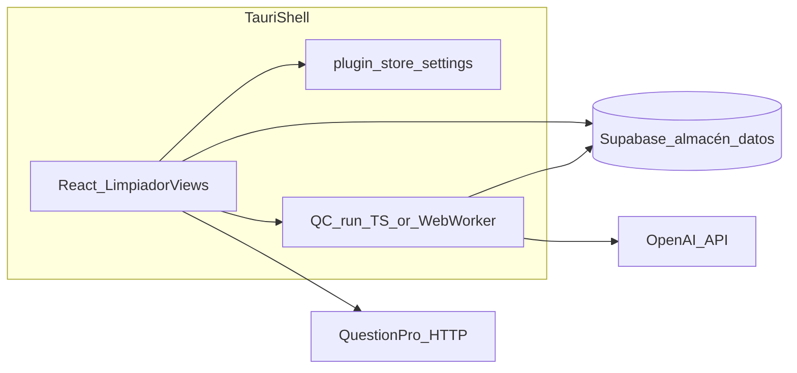

# Plan: Limpiador en Mega App Updater

## Principio rector — local para el equipo, sin web como requisito

- **Ejecución local:** modelo OpenAI, worker de QC, parseo pesado de Excel y decisiones del usuario ocurren en la PC vía **mega-app-updater**; no hay dependencia de Vercel ni de la VM Lightsail para el limpiado.
- **Sin interoperabilidad con el dashboard web:** no es objetivo que un proyecto creado o usado solo en esta app pueda «continuarse» en el navegador, ni mantener comportamiento paralelo entre web y desktop. Se simplifica UX y datos (**p. ej. API key QuestionPro sólo desde Ajustes**, columna `qp_api_key_encrypted` puede ir **NULL** si el esquema lo permite — no hay que republicar secrets en BD para uso web).
- **Supabase** sigue pudiendo ser el **motor de datos** (persistencia corporativa centralizada), pero desde la óptica del usuario final la **herramienta es la app**; no se diseña alrededor de “abrir lo mismo en la web”.
- **TypeScript primero:** lógica de la herramienta, cálculos simples y todo acceso Datos (**Supabase**), QuestionPro/OpenAI (**fetch** desde TS). **Rust no implementa dominio Limpiador** salvo fugaz glue del SO.
- **Rust como llave:** solo **`invoke`** (y comandos relacionados) para lo que Chromium no da: ejecutar proceso externo opcional, leer archivo por ruta nativa fuera del sandbox del WebView donde aplique, cancelación brutal de hijo OS, opcionalmente recibir secreto desde store nativo y reenviar a red **sin repetir la lógica de negocio en Rust**.

## Orden de implementación (obligatorio)

1. **Primero:** Ajustes — persistir en `tauri-plugin-store` todas las keys necesarias (sección inventario + UI con Aplicar / vacío en instalador).
2. **Después:** migración del Limpiador (spike worker, cliente Supabase, vistas, QC local según fases abajo).

## Alcance funcional (experiencia de usuario) — sí, está contemplado

El objetivo del port es que la persona pueda hacer **en la app de escritorio** el mismo tipo de flujo que hoy encadena el dashboard, sin depender de Vercel ni de la VM para el QC largo:

| Capacidad | En el plan | Nota de fase |
| --- | --- | --- |
| Elegir **origen** del proyecto (**Qualtrics** vs **QuestionPro**) al crear el limpiado | Sí | Parte del flujo “nuevo proyecto”; el schema `cleaning_projects.source` y campos QP ya están en migraciones del dashboard. Incluir en **F1** si `main` ya lo expone en UI; si no, alinear con **rama `dev`**. |
| **Subir archivo** Excel de respuestas (parser según origen) | Sí | Upload + inserción batch en `cleaning_rows` / versión en Supabase, como hoy con `xlsx` en cliente. |
| **IA que propone reglas** alineadas al cuestionario / columnas | Sí | Equivalente a `suggest-rules` (heurística + `gpt-4o-mini` coherencia); en app: key OpenAI en Ajustes + llamada local (TS o Rust). |
| **Conexión API QuestionPro** (enriquecer schema: preguntas/opciones/IDs, match con headers del Excel) | Sí | **Única fuente de verdad:** `questionpro.api_key` en **Ajustes**. Al crear proyecto solo `qp_survey_id` / nombre, etc.; **sin** campo de API key por proyecto salvo necesidad posterior explícita. Llamadas HTTP a QuestionPro siempre usan la key del store. |
| Ejecutar **QC pesado** (flags rojo/amarillo, progreso) | Sí | Motor local con **implementación predominante en TypeScript** (`src/lib/cleaning/…`), igual que antes la intención de escribir en tablas correspondientes; para no colgar UI usar **chunks async** y/o **Web Worker** TS. Rust solo si hace falta “puerta” OS (ej. proceso auxiliar muy aislado) — **sin** mover el algoritmo de QC a `.rs`. |
| **Revisión** de flags, decisiones keep/remove, **export** limpio | Sí | Pantallas review/export portadas desde `limpiador/...`. |
| Sync avanzado a QuestionPro (DELETE+POST, preservar metadata) del [limpiador-plan.md](file:///C:/Users/fsuar/Documents/Github/mega-dashboard/docs/limpiador-plan.md) | Previsto como **evolución** | Encaja en **F2** junto con mejoras de `dev` y el roadmap del `.md`, una vez establecido el núcleo local. |

En resumen: **origen QP/Qualtrics, subida, reglas asistidas por IA, QuestionPro desde Ajustes y todo el QC en la máquina**. Las fases separan **MVP de migración** (equivalente funcional al flujo del dashboard tomado como referencia de código) vs **mejoras `dev`/plan.md** (sync QP avanzado, etc.) — siempre bajo el principio **local-only**, no paridad con web.

---

## Contexto que ya está claro

- **Origen funcional:** El Limpiador en [mega-dashboard](file:///C:/Users/fsuar/Documents/Github/mega-dashboard) vive bajo [`src/app/(dashboard)/limpiador/`](file:///C:/Users/fsuar/Documents/Github/mega-dashboard/src/app/(dashboard)/limpiador/) con flujo por pasos (nuevo proyecto → upload → reglas → review/export). La lógica de datos y tipos está concentrada en [`src/lib/cleaning.ts`](file:///C:/Users/fsuar/Documents/Github/mega-dashboard/src/lib/cleaning.ts).
- **Supabase:** Mismas tablas documentadas en [`docs/migrations/2025-01-29_create-limpiador-tables.sql`](file:///C:/Users/fsuar/Documents/Github/mega-dashboard/docs/migrations/2025-01-29_create-limpiador-tables.sql) + migraciones posteriores en `supabase/migrations/` (QuestionPro, columnas IA en reglas, etc.). Las políticas RLS del SQL inicial son **muy permisivas** (`USING (true)`), coherente con uso de **anon key** desde cliente; conviene **verificar en producción** si endurecieron RLS (si sí, la app necesitaría login Supabase o service role en settings — decisión de seguridad).
- **Gargallo Vercel / VM:** El trabajo largo **no** está en Next: el front llama a `NEXT_PUBLIC_CLASSIFICATION_SERVICE_URL` con `POST /cleaning/clean-version` y polling de estado (ver [`cleaning.ts` ~732–871](file:///C:/Users/fsuar/Documents/Github/mega-dashboard/src/lib/cleaning.ts)). Ese worker **no está en el repo** del dashboard ([`docs/LIMPIADOR_DEPLOYMENT.md`](file:///C:/Users/fsuar/Documents/Github/mega-dashboard/docs/LIMPIADOR_DEPLOYMENT.md) describe archivos `cleaning-service.js` en Lightsail).
- **OpenAI:** En la app, **preferencia fuerte**: **`fetch`/`openai` desde TypeScript** con `openai.api_key` leído del store (mismo nivel de confianza que hoy Gemini en frontend). Opcional después: comando Rust ultrafino solo para **INYECTAR env** si no quieren jamás la key en el contexto del WebView — el prompt y parsing de respuesta siguen en TS.
- **Encriptación en el dashboard legacy:** Las rutas Next usaban `encrypt_text` para guardar la key QP en `cleaning_projects`. Como la app es **solo local**, **no hace falta** replicar ese flujo: la key QP no sale de Ajustes; `qp_api_key_encrypted` puede quedar **NULL** al insertar proyecto (confirmar nullable en tu schema). Opcional mantener campo **`encryption.key`** en Ajustes solo si en el futuro quisieren encriptar algún secreto antes de persistirlo en tabla.

**Roadmap producto (.md):** [limpiador-plan.md](file:///C:/Users/fsuar/Documents/Github/mega-dashboard/docs/limpiador-plan.md) sigue sirviendo como guía de mejoras locales (sync QP, etc.), no como alineación con el producto web.

---

## Arquitectura objetivo en mega-app-updater



- **UI:** Nueva herramienta en el patrón existente ([`Toolbar.tsx` ToolId](file:///D:/Github/mega-app-updater/src/components/Toolbar.tsx), [`App.tsx`](file:///D:/Github/mega-app-updater/src/App.tsx), [`HomeView.tsx`](file:///D:/Github/mega-app-updater/src/tools/home/HomeView.tsx)): por ejemplo `limpiador`.
- **Ajustes:** [`settings.ts`](file:///D:/Github/mega-app-updater/src/lib/settings.ts) / [`SettingsView.tsx`](file:///D:/Github/mega-app-updater/src/tools/settings/SettingsView.tsx) — inventario de keys; OpenAI se consume desde **TS** por defecto.

### Inventario de claves en Ajustes

**Para Limpiador + backend compartido (nuevos campos, vacíos en instalador por defecto):**

| Campo persistido (sugerencia) | Equivalente dashboard / uso |
| --- | --- |
| `supabase.url` | URL del proyecto Supabase usado desde la desktop app para tablas `cleaning_*`. |
| `supabase.anon_key` | Anon key del mismo proyecto (`NEXT_PUBLIC_*` equiv. en otros productos internos). |
| `openai.api_key` | `OPENAI_API_KEY` — reglas sugeridas / coherencia (`suggest-rules`); mismo modelo puede servir otros pasos IA del Limpiador. |
| `questionpro.api_key` | **QuestionPro REST API key** por máquina (Ajustes). Usada para `GET /surveys/...` y futuro sync QP. |
| `encryption.key` | **Opcional** en enfoque local-only. Solo si más adelante se decide guardar secretos vía `encrypt_text` en Supabase; **no requerido** si la key QP no se persiste en fila. |

**Identificadores por proyecto** (no son «keys» en Ajustes): `surveyId` QuestionPro / metadatos de encuesta siguen eligiéndose al **crear o editar proyecto** porque cambian por estudio.

**Otras herramientas ya en mega-app** (mantener UI existente):

| Campo existente | Uso |
| --- | --- |
| `gemini.api_key` | Brand Audit (`SettingsView` / [`settings.ts`](file:///D:/Github/mega-app-updater/src/lib/settings.ts)) — independiente del Limpiador. |

**No configurables por el usuario en Ajustes** (solo build/CI/ops):

| Secreto | Dónde vive |
| --- | --- |
| Token GitHub Releases (lector) | `UPDATER_*` compile-time para el updater (`option_env!` en Rust), ver [`DEV_GUIDE.md`](file:///D:/Github/mega-app-updater/docs/DEV_GUIDE.md). |

Set mínimo que la empresa suele pasar para **Limpiador**: **Supabase URL + anon + OpenAI + QuestionPro** (+ **Gemini** si usan Brand Audit). **`encryption.key`** solo si adoptan encriptación en BD. Instalador con campos vacíos; **Aplicar** en Ajustes.

- **Cliente Supabase:** Añadir `@supabase/supabase-js` **en la fase de migración** (después de Ajustes); cliente creado con `supabase.url` y `supabase.anon_key` leídos del store. Portar helpers desde [`mega-dashboard/src/lib/cleaning.ts`](file:///C:/Users/fsuar/Documents/Github/mega-dashboard/src/lib/cleaning.ts) sin `process.env` de Next.

**Pieza crítica — QC local (TypeScript):** Sustituir `startCleaningJob` + polling al servidor remoto por un **motor en TS** que lea reglas/filas (Supabase), llame OpenAI según patrón actual y persista `cleaning_flags` + progreso en `cleaning_versions`.

1. **F0:** Extraer o reconstruir el comportamiento del servicio Lightsail (`cleaning-service.js`) como **referencia**; la implementación objetivo en esta app es **TypeScript** (no un rewrite en Rust ni Python salvo decisión explícita posterior por performance).
2. Evitar bloqueo de UI: batches con `await`, `requestIdleCallback` / `setTimeout(0)` entre lotes, o **Web Worker** que ejecute el bucle de QC y comunique progreso por `postMessage` al hilo React.
3. **Rust:** solo comandos `invoke` si hace falta algo que el WebView no otorga (lectura de path absoluto, spawn de utilidad, cancelación de subproceso). El **algoritmo de limpieza** no vive en Rust.

El motor TS debe mantener **`status` / `progress_percentage` / `processed_rows`** coherente con la UI esperada ([`cleaning_versions`](file:///C:/Users/fsuar/Documents/Github/mega-dashboard/docs/migrations/2025-01-29_create-limpiador-tables.sql) como referencia de columnas).

---

## ¿Backend? Regla cerrada para este proyecto: TS + Rust-finísimo

| Parte | Lenguaje en mega-app-updater |
| --- | --- |
| CRUD, reglas, flags, merges, estadísticas | **TypeScript** |
| HTTP OpenAI, QuestionPro | **TypeScript** |
| Parsing Excel hasta donde aguante el WebView | **TypeScript** (`xlsx`); si después un archivo fuerza usar FS nativo grande, **`invoke` Rust solo para leer bytes / path** devolviendo a TS o guardando temporal — decisión infra, **no dominio**. |
| QC fila a fila (viejo JS en Lightsail) | **Port a TypeScript**; Worker si hace falta. |
| Lo que antes era `/api/*/route.ts` | **Funciones TS** en `src/lib/cleaning/`, llamadas desde componentes React. |

**Rust:** papel de **“llave” / bridge OS**: registra `invoke` en `lib.rs`, permisos en `capabilities`, y **solo** código mínimo (spawn read child, stdin/stdout si algún día hay proceso auxiliar, diálogo nativo, etc.). Si un `invoke` hace HTTPS “por seguridad”, que sea solo **tunnel de credencial**, no reimplementación de reglas QC.

**(Obsoleto para el plan vigente)** la tabla larga anterior “¿Rust vs Python vs TS?” y la preferencia explícita por Python para QC; queda archivado en el historial de chat — el criterio fijado por el equipo es **TS para lógica**, Rust para **puertas del SO**.

---

## Portado de UI y flujo de pantallas

- Copiar/refactorizar componentes de [`limpiador/`](file:///C:/Users/fsuar/Documents/Github/mega-dashboard/src/app/(dashboard)/limpiador/) desacoplados de **`next/link`**, `next/router`, y layouts del dashboard — sustituir por estado local/React Router opcionalmente **solo si** queréis URLs internas (hoy mega-app usa `activeView`; se puede hacer sub-estado dentro de Limpiador o añadir mini-router más adelante).
- Reemplazar llamadas `fetch('/api/cleaning/...')` por lógica en app:
  - **create project:** `insert` en `cleaning_projects` con `source`, ids/nombres QP, **`qp_api_key_encrypted` = NULL** (u omitido) cuando la política sea «solo store» — validar NOT NULL/constraints del schema antes de cerrar MVP.
  - **suggest-rules:** **TypeScript** en [`suggest-rules.ts`](file:///D:/Github/mega-app-updater/src/lib/cleaning/suggest-rules.ts); opcional comando Rust sólo tunnel de secreto (sin parsing de prompts en Rust).
  - **enrich-schema QuestionPro:** port basado en [`enrich-schema/route.ts`](file:///C:/Users/fsuar/Documents/Github/mega-dashboard/src/app/api/cleaning/questionpro/enrich-schema/route.ts) usando **únicamente** `questionpro.api_key` desde Ajustes (sin bifurcar por proyectos legacy web).
- Upload Excel / XLSX: **TS** (`xlsx`) como primera opción; si un caso extremo necesita rutas/absolutas o archivo enorme desde FS, **`invoke` Rust** sólo como lectura/stream hacia TS (sin lógica de limpieza en Rust).

---

## Seguridad y operación interna

- **Keys en texto en store:** mismo modelo que Gemini hoy ([`settings.ts`](file:///D:/Github/mega-app-updater/src/lib/settings.ts)). Documentar para IT que el JSON en `%APPDATA%\Mega App\settings.json` contiene secretos corporativos; opcional después: usar **credential manager** en Windows vía Rust.
- **Ya no hay servicio externo de cleaning:** el worker local usa credenciales del store contra Supabase y OpenAI; el patrón Bearer al Lightsail ([`cleaning.ts`](file:///C:/Users/fsuar/Documents/Github/mega-dashboard/src/lib/cleaning.ts)) **no se replica** en la app de escritorio.
- **Alinear RLS:** Si mañana restringís políticas por `auth.uid()`, la app debe autenticar contra Supabase (email/pass o magic link) — planificar solo si lo exige la DB prod.

---

## Fases recomendadas

| Fase | Contenido |
|------|-----------|
| **Paso 1 (antes que el Limpiador)** | **Únicamente** Ajustes: keys en store + UI (Limpiador: Supabase, OpenAI, QuestionPro; opcional encryption; Gemini ya existente agrupado en la misma pantalla si conviene UX). Validar que no se persistan defaults en código. |
| **F0 — Spike** | Código Lightsail / contrato QC local y escritura en tablas Supabase necesarias desde la máquina. |
| **F1 — MVP migración herramienta** | `@supabase/supabase-js`, módulo `cleaning` portado, flujo **nuevo proyecto** (QP/QT), upload, IA reglas, enrich QP (**key Ajustes**), **QC local**, review/export — todo **solo app**. |
| **F2 — Mejoras `dev`/plan.md** | Sync QP avanzado, columnas/metadata IA en reglas, revisión/export enriquecidos según documentos del otro repo. |
| **F3 — Endurecer** | Workers TS tuning, archivos grandes (Rust solo puente FS), comando Rust opcional **solo tunnel** si endurecen seguridad de API keys sin mover reglas IA a Rust. |

---

## Estructura de archivos sugerida (`mega-app-updater`)

Siguiendo el patrón actual (**una carpeta por herramienta** bajo [`src/tools/`](file:///D:/Github/mega-app-updater/src/tools), libs en [`src/lib/`](file:///D:/Github/mega-app-updater/src/lib)):

**Convención:** carpeta **`limpiador`** en UX (nombre de la herramienta); subcarpeta **`cleaning`** (dominio/tablas como en mega-dashboard).

```
mega-app-updater/
├── src/
│   ├── lib/
│   │   ├── settings.ts                 # + keys Limpiador
│   │   ├── tauri.ts                    # + invoke sólo donde el SO lo exija (nombrado `limpiador_os_*` opcional)
│   │   └── cleaning/
│   │       ├── supabase-client.ts      # createClient(url, anon) desde settings
│   │       ├── types.ts                # CleaningProject, Rule, Row, Flags…
│   │       ├── repositories.ts        # proyecto / versión / reglas / filas (wrappers Supabase)
│   │       ├── jobs-local.ts          # orquesta QC TS / Worker + opcional invoke OS
│   │       ├── questionpro.ts         # cliente HTTP QP (basado en mega-dashboard)
│   │       └── suggest-rules.ts       # suplente del route suggest-rules + OpenAI
│   │
│   ├── tools/
│   │   └── limpiador/
│   │       ├── LimpiadorView.tsx      # shell: pasos o estado de navegación interna
│   │       ├── useLimpiadorSettings.ts  # opcional: leer store / validación de keys
│   │       ├── routes/               # vistas por pantalla (equivalente a rutas Next)
│   │       │   ├── ProjectList.tsx
│   │       │   ├── NewProject.tsx
│   │       │   ├── UploadVersion.tsx
│   │       │   ├── RulesEditor.tsx
│   │       │   ├── Review.tsx
│   │       │   └── Export.tsx
│   │       └── components/           # tabla, badges de flags, modales sólo Limpiador
│   │
│   ├── components/                  # Toolbar, TitleBar… (existentes)
│   └── App.tsx
│
└── src-tauri/src/
    ├── lib.rs
    └── commands/
        └── limpiador_os_bridge.rs   #invoke fino: FS, spawn opcional, tunnel secreto; sin lógica QC
```

*No-MVP:* proceso auxiliar (p.ej. Python) solo si después la medición exige algo que TS+Worker no rinda — política vigente **TypeScript-first**.

**Mapeo “Next `route.ts` → archivos TS”** (sin carpeta `api/` en desktop):

| Ruta mega-dashboard (`api/cleaning/…`) | Destino típico en la app |
| --- | --- |
| `projects` | [`repositories.ts`](file:///D:/Github/mega-app-updater/src/lib/cleaning/repositories.ts) + pantalla [`NewProject.tsx`](file:///D:/Github/mega-app-updater/src/tools/limpiador/routes/NewProject.tsx) |
| `suggest-rules` | [`suggest-rules.ts`](file:///D:/Github/mega-app-updater/src/lib/cleaning/suggest-rules.ts); opción Rust sólo puente de secreto |
| `questionpro/enrich-schema` | [`questionpro.ts`](file:///D:/Github/mega-app-updater/src/lib/cleaning/questionpro.ts) + llamada desde upload/reglas |

**Rust:** comandos `invoke` **únicamente** donde el WebView no alcanza (FS nativo extremo, spawn, tunnel de credencial); **sin** exponer rutas tipo HTTP-server ni reimplementar reglas/endpoints Limpiador.

---

## Archivos tocados en mega-app-updater (resumen ejecutivo)

- [`src/App.tsx`](file:///D:/Github/mega-app-updater/src/App.tsx), [`Toolbar.tsx`](file:///D:/Github/mega-app-updater/src/components/Toolbar.tsx), [`HomeView.tsx`](file:///D:/Github/mega-app-updater/src/tools/home/HomeView.tsx): entrada herramienta.
- [`src/lib/settings.ts`](file:///D:/Github/mega-app-updater/src/lib/settings.ts), [`SettingsView.tsx`](file:///D:/Github/mega-app-updater/src/tools/settings/SettingsView.tsx): nuevas keys.
- Nueva área: **`src/tools/limpiador/`**, **`src/lib/cleaning/`**, y en Tauri sólo comandos **`limpiador_os_bridge`** (o nombre equivalente) — capa OS/invoke ultrafina.
- [`src-tauri/src/lib.rs`](file:///D:/Github/mega-app-updater/src-tauri/src/lib.rs): registrar esos comandos.

---

## Riesgos / dependencias

- **Sin código del classification service**, el tiempo F1 depende de **extraer el código del servidor** o **reimplementar** el QC — hay que cerrarlo en **F0** antes de declarar MVP.
- **`qp_api_key_encrypted` NOT NULL o triggers:** revisar migrations reales si se inserta proyecto con key solo en settings; puede requerir default NULL o cambio DDL en Supabase corporativo **solo si** el constraint lo bloquea.
- **RLS anon:** igual que antes, validar en el proyecto Supabase que la política permite operaciones necesarias desde la desktop app (solo uso interno, no web mixto).

