# Conexión de Proyectos — Validador → QuestionPro → Limpiador

> **Documento de diseño.** No hay código todavía: esto describe cómo se conectarían el **Validador de Cuestionarios** y el **Limpiador de Encuestas** a través de QuestionPro, qué problemáticas aparecen y cómo resolverlas.
>
> Planes relacionados: [cuestionario-validator-plan.md](./cuestionario-validator-plan.md) (el Validador, todavía sin implementar), [limpiador-plan.md](./limpiador-plan.md) (el Limpiador, implementado) y [LIMPIADOR_QC_CONTRACT.md](./LIMPIADOR_QC_CONTRACT.md) (contrato de escrituras del QC).

## Resumen

El Validador y el Limpiador son las dos puntas del mismo ciclo de vida de una encuesta y hoy están desconectados. El Validador trabaja **antes** de lanzar la encuesta (parsea un documento crudo a un JSON canónico, valida coherencia, deja el cuestionario "aprobado"); el Limpiador trabaja **después** de recolectar respuestas (detecta y elimina respuestas inválidas a partir del Excel de respuestas y la API de QuestionPro). Entre medio está QuestionPro, donde la encuesta efectivamente se programa y se corre.

Este documento diseña el puente entre los tres. La cadena completa queda así:

```
documento crudo
  → Validador: parsea a Questionnaire canónico + valida coherencia
  → usuario corrige los issues
  → "Publicar en QuestionPro": crea la encuesta vía API
  → QuestionPro devuelve surveyID + nombre + URL
  → "Crear proyecto en Limpiador": siembra un proyecto con source=questionpro, qp_survey_id
  → el proyecto queda en standby (no se puede avanzar) hasta que haya respuestas
  → llega el Excel de respuestas → flujo normal del Limpiador (Upload → Rules → Review → Export → sync a QP)
```

**Estado:** documento de diseño, cero código. Prerrequisito real para implementar cualquier cosa de acá: el Validador tiene que existir al menos hasta el punto de producir un `Questionnaire` canónico validado (Iteraciones 1–3 de su plan).

```mermaid
flowchart LR
    Doc["Documento crudo<br/>(docx / pdf / texto / API QP)"] --> Val["Validador<br/>parsea + valida"]
    Val --> Fix["Usuario corrige<br/>los issues"]
    Fix --> Pub["Publicar en QuestionPro<br/>(crea encuesta vía API)"]
    Pub --> QP[("QuestionPro<br/>surveyID, nombre, URL")]
    QP --> Seed["Crear proyecto Limpiador<br/>source=questionpro, qp_survey_id"]
    Seed --> Standby["Proyecto en standby<br/>esperando respuestas"]
    Standby -->|"llega el Excel"| Clean["Flujo del Limpiador<br/>Upload → Rules → Review → Export → sync"]
    Pub -.->|opcional, futuro| Reuse["El Limpiador reusa el<br/>cuestionario validado al subir el Excel"]
    Clean -.-> Reuse
```



## Las tres piezas y la frontera de datos

| Pieza | Rol | Qué aporta | Qué cruza la frontera |
|---|---|---|---|
| **Validador de Cuestionarios** | Pre-launch | El `Questionnaire` canónico validado: preguntas, opciones, tipos, secciones, flujo, condiciones | Hacia QP: el `Questionnaire` traducido a payloads de creación. Hacia el Limpiador: `qp_survey_id`, `qp_survey_name`, (opcional) `questionnaire_id` |
| **QuestionPro** | Sistema externo donde corre la encuesta | El `surveyID`, el nombre, la URL pública; más adelante, las preguntas con sus `questionID` y las respuestas | Hacia el Validador: confirmación de creación + IDs. Hacia el Limpiador: el Excel de respuestas y la API de respuestas (esto ya existe hoy) |
| **Limpiador de Encuestas** | Post-collection | El proyecto de limpieza, las versiones (Excel), las reglas de QC, los flags, el sync de vuelta a QP | — (es el extremo final de la cadena) |

Una observación clave: las dos herramientas viven en el **mismo proyecto Supabase corporativo** (el del Limpiador). Eso hace viable enlazar registros entre ellas con una simple FK. Si el Validador todavía no está implementado, cualquier columna de enlace queda en `NULL` y no rompe nada.

## Etapa A — Validador → QuestionPro: "Publicar encuesta"

### Trigger y semántica

Un botón **"Publicar en QuestionPro"** en el reporte del Validador, habilitado sólo cuando no hay issues de severidad `error` (si los hay, se permite igual pero con una confirmación explícita "publicás con errores conocidos"). Crear una encuesta en QuestionPro es una **acción saliente e irreversible** desde la app: hay que confirmar antes, mostrando un resumen de lo que se va a crear (N preguntas, M secciones, idioma, país). Una vez publicado, el botón muta a **"Ver encuesta en QP"** + **"Crear proyecto en Limpiador"**.

### Endpoints de QuestionPro

La API v2 de QuestionPro soporta creación programática (verificado contra la documentación pública; algunos detalles quedan pendientes de confirmar contra una encuesta real):

1. `POST /surveys` — crea la encuesta vacía. Devuelve `surveyID`, `name`, `surveyURL`, `status`, fechas. *Pendiente de confirmar:* la doc de "Create User Survey" menciona un path param `user-id`, así que el endpoint real podría ser `POST /users/{userId}/surveys`; hay que resolver de dónde sale ese `userId` (otro endpoint, o viene en la respuesta de algún `GET`).
2. `POST /surveys/{surveyId}/questions` — por cada pregunta. Payload documentado: `{ type, text, code, required, answers: [{ text, excludeRandomization }] }`. Devuelve `questionID`, `blockID`, `orderNumber` + lo enviado.
3. `POST /surveys/{surveyId}/blocks` — opcional, para mapear las `secciones` del cuestionario a bloques de QuestionPro y que la encuesta quede organizada.

El orquestador (en `src/lib/questionpro.ts`, cuando se implemente) sería algo como `publishQuestionnaireToQP(questionnaire, apiKey)`: crea el survey, después itera las preguntas (respetando el orden de `secciones` si se usan bloques), y va guardando el mapeo `Question.id → questionID` por si hace falta después (skip logic, enriquecimiento posterior).

### Mapeo de tipos canónicos → tipos de QuestionPro

El `QuestionType` del canónico no es 1:1 con los `type` de QuestionPro. Esta tabla es **tentativa** — hay que validarla contra `question-type.html` de la doc de QP antes de implementar:

| `QuestionType` canónico | `type` de QuestionPro (tentativo) | Notas |
|---|---|---|
| `cerrada_unica` | `multiplechoice_radio` | directo |
| `cerrada_multiple` | `multiplechoice_checkbox` | directo |
| `escala` | `multiplechoice_radio` con opciones numeradas, o `numericslider` | depende de si la escala tiene etiquetas; `min`/`max` del canónico → rango |
| `matriz` | `multiplechoice_matrix` / `lookup_table` | los `enunciados` del canónico van como filas; las `opciones` como columnas |
| `abierta_texto` | `text` (línea simple) o `comments` (multilínea) | heurística por longitud esperada |
| `abierta_marca` | `text` | |
| `numerica` | `numeric` o `text` con validación numérica | |
| `ranking` | `rank_order` | |
| `fecha` | `date` | |

Donde no haya equivalente exacto, **degradar a `multiplechoice_radio` o `text` y registrar un warning por pregunta** ("esta pregunta se creó como X porque QP no tiene un tipo equivalente; revisala en QP"). El reporte de publicación debe listar esas degradaciones.

El `metadata.idioma` del cuestionario mapea al `languageID` de la encuesta (otra tabla de mapeo, idioma → ID de QP); si no se reconoce, default + warning. El `metadata.pais` no tiene un campo obvio en QP — probablemente se ignora o va a un custom variable.

### Skip logic / flujo — el problema gordo

El `Questionnaire` canónico tiene `flujo: FlowRule[]` (saltos por respuesta) y `condicion: string` (la pregunta sólo aparece si `S1=3`, etc.). **La documentación de "Create Question" de QuestionPro no menciona branching ni skip logic.** Es muy posible que la lógica de saltos no se pueda crear por API y haya que configurarla a mano en la UI de QP.

Mitigación recomendada (Etapa A v1):

- Crear las preguntas **sin lógica de salto** ("planas").
- Generar un **checklist exportable de saltos** a partir del canónico ("P3: si respuesta = 'No' → saltar a P7", etc.) para que el usuario lo configure en QP.
- Dejar una nota visible en el reporte de publicación: *"Los saltos y condiciones no se crearon automáticamente. Configuralos en QuestionPro usando este checklist."*

A futuro: investigar si existe un endpoint tipo `POST /surveys/{id}/logic` o si los bloques admiten condiciones; si aparece, automatizarlo. Mientras tanto, el flujo manual es aceptable porque el cuestionario ya fue validado (el Validador ya verificó que los saltos sean coherentes).

### Randomización

`Question.aleatorizar: boolean` → el setting de aleatorización de la pregunta en QP (campo a confirmar). Las `QuestionOption` con `condicion: ["fijar"]` → `excludeRandomization: true` en el `answer` correspondiente.

### Datacenter de QuestionPro

`QP_API_BASE` en `src/lib/questionpro.ts` está hardcodeado a `https://api.questionpro.com/a/api/v2`. La doc de QP menciona `{{env}}` (`api`, `ca`, `eu` según el datacenter de la cuenta). Si la cuenta del usuario está en otro datacenter, todo falla — pero esto **ya es así hoy** para `validateSurvey`, `getSurveyQuestions`, etc. Por ahora se asume `.com`; queda anotado como deuda. Si en algún momento aparece un usuario en otro datacenter, se agrega un setting de datacenter en Ajustes y se construye la base URL desde ahí.

### Creación parcial y reintentos

Si `POST /surveys` funciona pero después falla `POST .../questions` a mitad del loop, queda una encuesta a medias en QP. Mitigación:

- Reportar claramente: *"Se creó la encuesta {surveyID} ({nombre}) pero falló al crear la pregunta {n}. Revisala o borrala en QuestionPro."* + link directo a la encuesta.
- Opcional (decisión pendiente): **rollback** — si falla, hacer `DELETE /surveys/{surveyId}` para no dejar basura. Contra: si el usuario quería conservar lo que se creó, el rollback se lo borra. A favor: estado limpio. Sugerencia: **no** hacer rollback automático; ofrecer un botón "borrar la encuesta a medias" en el mensaje de error.

### Persistencia del lado del Validador

Tras publicar con éxito, el registro en `questionnaires` (la tabla del plan del Validador) guarda `qp_survey_id`, `qp_survey_name` y `qp_published_at`. Eso permite: (1) mostrar el estado "publicado el {fecha}" en la UI del Validador; (2) habilitar el botón "Crear proyecto en Limpiador"; (3) detectar drift (ver problemática #7).

## Etapa B — QuestionPro → Limpiador: "Crear proyecto"

### Trigger

Un botón **"Crear proyecto en Limpiador"** en el reporte del Validador, visible una vez que el cuestionario tiene `qp_survey_id`. (También sirve para el caso degradado: si la cuenta de QP no permite crear encuestas por API, el usuario crea la encuesta a mano en QP, pega el `surveyID` en el Validador, y el botón se habilita igual — ver problemática #12.)

### Navegación entre herramientas

Hoy `src/App.tsx` cambia de herramienta seteando `activeView`, y `LimpiadorView` siempre arranca en la sub-vista `"list"`. No hay router ni estado compartido entre herramientas — es una decisión de diseño (ver `CLAUDE.md`). Para "navegar con payload" del Validador al Limpiador hace falta un canal.

**Solución recomendada:** prop drilling desde `App.tsx`, consistente con el patrón actual.

- `App.tsx` mantiene un estado `pendingLimpiadorSeed: { qpSurveyId, qpSurveyName, questionnaireId, name } | null`.
- El botón del Validador setea ese estado y cambia `activeView` a `"limpiador"`.
- `LimpiadorView` recibe el seed como prop. Al montar, si hay seed: lo consume **una sola vez** (lo limpia para que no se re-dispare), llama a `createProject(...)`, y navega a `"project"` con el `projectId` recién creado.

Alternativas descartadas: un store global (zustand) o un event bus — más maquinaria de la que el patrón actual justifica para un solo punto de integración.

### Qué se crea

`createProject` ya existe en `src/lib/cleaning/projects-repository.ts` y acepta exactamente lo que necesitamos:

```ts
createProject({
  name,            // autocompletado con questionnaire.metadata.titulo, editable antes de confirmar
  description,
  source: "questionpro",
  qpSurveyId,      // el surveyID de QP
  qpSurveyName,    // el nombre que devolvió QP / validateSurvey
})
```

Antes de crear, se le muestra al usuario un mini-form (nombre editable + descripción opcional) para que pueda ajustar el nombre del proyecto.

### Seeding = opción A: proyecto vacío, standby hasta el Excel

El proyecto se crea **vacío**: sin `cleaning_version`, sin schema, sin reglas. Cae en la pantalla `ProjectDetail` con un banner: *"Esperando respuestas — subí el Excel de QuestionPro para empezar a configurar reglas."*. El paso de Reglas (`Rules.tsx`) **bloquea** (no sólo deshabilita las sugerencias IA) hasta que exista una versión: hoy `Rules.tsx` ya muestra un banner "subí un archivo primero" cuando `versions.length === 0`, pero hay que reforzarlo para que efectivamente no se pueda escribir nada (el autocompletado `@columna` y las sugerencias de coherencia necesitan el `VersionSchema` del Excel para tener algo contra qué operar).

**Nota de contexto.** La idea original era *"ir directo al paso de Reglas, que quede en standby"*. Se cambió a *"caer en el detalle del proyecto con un banner"* porque el paso de Reglas no tiene sentido sin el `VersionSchema` del Excel (no hay columnas contra las cuales escribir reglas ni autocompletar). El *standby* es el mismo concepto; lo único que cambia es la pantalla de aterrizaje: en vez de Reglas vacío, el detalle del proyecto con el banner.

### Por qué A y no "sembrar con una versión sintética del cuestionario"

La opción tentadora sería convertir el `Questionnaire` canónico en un `VersionSchema` y crear una "versión 0" sin filas, para que el paso de Reglas funcione desde el día 1. Se descartó porque esa conversión es **lossy** y produciría reglas que después no calzan con el Excel real:

- Una pregunta `matriz` se expande a **N columnas** en el export Excel de QuestionPro (una por `enunciado`), no una.
- Una `cerrada_multiple` puede expandirse a N columnas binarias en algunos formatos de export.
- El parser de Excel del Limpiador **inyecta columnas `META_*`** (ID respuesta, fecha, IP, etc.) que no existen en el cuestionario.
- El `qp_question_id` que el Limpiador usa para enriquecer el schema (`src/lib/cleaning/enrich-schema.ts`) recién se conoce **después** de que QP devuelva las preguntas creadas — y aun así el match real al Excel se hace por **texto normalizado**, no por ID.

Conclusión: escribir reglas contra un schema que después no va a coincidir 1:1 con el Excel real es peor que no tener reglas. La opción A es honesta: *"todavía no hay datos, esperá a las respuestas"*. El día que llegue el Excel, ahí sí se enriquece (Etapa C).

### Enlace cuestionario ↔ proyecto

Recomendación: agregar una columna `questionnaire_id UUID` (FK opcional a `questionnaires`, `ON DELETE SET NULL`) en `cleaning_projects`. Sirve para trazabilidad y habilita la Etapa C. Implicancias:

- Migración nueva en `docs/migrations/`.
- Documentar el write nuevo en `docs/LIMPIADOR_QC_CONTRACT.md`.
- Si el Validador no está implementado, la columna queda `NULL` siempre — inocuo.
- Conviene además un índice **`UNIQUE` parcial** sobre `cleaning_projects(qp_survey_id) WHERE qp_survey_id IS NOT NULL` para que la regla "un proyecto por encuesta" se cumpla a nivel DB y no dependa sólo del chequeo en código (problemática #8/#15).

### Duplicados

Al crear el proyecto, chequear si ya existe un `cleaning_projects` con ese `qp_survey_id`. Si existe: avisar (*"Ya hay un proyecto de limpieza para esta encuesta"*) y ofrecer abrir el existente en vez de crear otro. El índice `UNIQUE` parcial es la red de seguridad por si dos creaciones corren casi simultáneas.

## Etapa C (opcional, futuro) — el Limpiador reusa el cuestionario validado

Cuando el proyecto sembrado por fin recibe su Excel: en `Upload.tsx`, después del parseo y de `enrichSchemaWithQuestionPro` (el enriquecimiento por API que ya existe), si el proyecto tiene `questionnaire_id`, ofrecer *"Enriquecer también con el cuestionario validado"*. Eso trae del canónico el `flujo`, las `condicion`, el `tipo` canónico y las `secciones` → enriquece el `VersionSchema` más allá de lo que da la API de QP sola (la API no expone bien la skip logic) → mejores reglas de coherencia automáticas en el paso 4 del Limpiador.

Esto **reformula** (no reescribe) la "Iteración 6" del plan del Validador, que hoy está planteada como "importar el cuestionario en el paso 3 de generación de reglas del Limpiador". Ese plan debería apuntar a este documento.

## Problemáticas transversales y mitigaciones

| # | Problemática | Impacto | Mitigación |
|---|---|---|---|
| 1 | QuestionPro no documenta creación de skip logic / branching por API | El `flujo`/`condicion` del canónico no se transfiere; encuestas creadas "planas" | Crear preguntas sin lógica + exportar un checklist de saltos para configurar a mano en QP + nota visible; investigar a futuro un endpoint de logic |
| 2 | No hay router ni estado compartido entre herramientas (por diseño) | No se puede "navegar con payload" del Validador al Limpiador out of the box | `App.tsx` mantiene `pendingLimpiadorSeed`, lo pasa como prop a `LimpiadorView`, que lo consume una vez al montar |
| 3 | Datacenter de QP hardcodeado a `.com` | Cuentas en `ca`/`eu` fallan al crear/leer (ya pasa hoy) | Asumir `.com` como hoy; deuda anotada; eventual setting de datacenter en Ajustes |
| 4 | Creación parcial de encuesta si falla a mitad de las preguntas | Quedan preguntas a medias en QP | Reportar "encuesta {id} creada parcialmente" + link a QP + botón "borrar la encuesta a medias"; sin rollback automático |
| 5 | Mapeo de tipos canónicos → tipos de QP no es 1:1 | `escala`/`matriz`/`ranking` sin equivalente exacto | Tabla de mapeo con fallbacks explícitos + warning por pregunta degradada; verificar `question-type.html` antes de implementar |
| 6 | Conversión `Questionnaire → VersionSchema` es lossy | Un proyecto sembrado con un schema "del cuestionario" no coincidiría con el Excel real | Seeding opción A: proyecto vacío, no avanza sin Excel real; el enriquecimiento con el cuestionario es opcional (Etapa C) y va por match de texto |
| 7 | El usuario edita el cuestionario en el Validador *después* de publicarlo en QP | Drift entre el canónico y la encuesta real de QP | Marcar el cuestionario como "publicado el {fecha}"; al detectar ediciones posteriores, avisar "esta encuesta ya fue publicada; los cambios no se reflejan en QP automáticamente". No re-sincronizar (fuera de alcance) |
| 8 | Dos proyectos del Limpiador para la misma encuesta | Duplicados | Chequear `qp_survey_id` existente al crear → avisar / ofrecer abrir el existente. Índice `UNIQUE` parcial como red de seguridad (ver #15) |
| 9 | Las API keys (QP, OpenAI) que necesita el Validador | — | Reusar `src/lib/settings.ts` tal cual (`questionpro.api_key`, `openai.api_key`); el Validador exige la key de QP sólo para "publicar" y la de OpenAI para parsear/validar |
| 10 | Permisos de la API key de QP: leer encuestas ≠ crear encuestas | "Publicar" puede dar 403 aunque "validar" funcione | Mensaje de error claro ("tu API key no tiene permiso para crear encuestas") + link a la doc de scopes de QP |
| 11 | Migraciones SQL nuevas (`questionnaire_id` en `cleaning_projects`, tablas del Validador) | Hay que aplicarlas en el Supabase corporativo | Migraciones en `docs/migrations/`; documentar los writes nuevos en `docs/LIMPIADOR_QC_CONTRACT.md` |
| 12 | ¿Y si la cuenta de QP no permite crear encuestas (licencia/plan)? | El flujo "publicar" no aplica a ese usuario | Degradar elegante: si `POST /surveys` da 403, ocultar "Publicar en QP" y dejar sólo "ya tengo el survey ID → pegalo → crear proyecto Limpiador" |
| 13 | La encuesta se borra/archiva en QP después de creado el proyecto Limpiador | Proyecto huérfano; el sync (paso 5.C) y el enriquecimiento fallan con 404 | Detectar el 404 al cargar el proyecto / al subir el Excel → marcar el proyecto como "encuesta no disponible en QP" sin romper; permitir seguir trabajando offline con el Excel ya cargado |
| 14 | Una sola `questionpro.api_key` compartida entre usuarios de Mega | Toda encuesta publicada queda bajo esa misma cuenta de QP; no hay "dueño" real por usuario | Documentarlo como limitación conocida; no bloqueante hoy; eventual key por usuario |
| 15 | Unicidad de `qp_survey_id` a nivel DB | La mitigación #8 (chequeo en código) asume que no hay carrera | Índice `UNIQUE` parcial: `cleaning_projects(qp_survey_id) WHERE qp_survey_id IS NOT NULL` en la migración |
| 16 | `metadata.idioma` / `metadata.pais` del canónico → settings de la encuesta en QP | Probablemente trivial, pero hoy no está mapeado | Mapeo idioma → `languageID` en la tabla de la Etapa A; si no se reconoce, default + warning; `pais` probablemente se ignora o va a un custom variable |

## Cambios concretos que implicaría (futuro, fuera de alcance de este doc)

Listado de referencia para cuando se implemente:

- **`src/lib/questionpro.ts`** — `createSurvey(...)`, `createQuestion(surveyId, ...)`, `createSurveyBlock(...)`, `publishQuestionnaireToQP(questionnaire, apiKey)` (orquestador) y la tabla de mapeo de tipos canónicos → tipos de QP.
- **`src/lib/cuestionario/...`** (cuando exista el Validador) — botón "Publicar en QP" + persistir `qp_survey_id`/`qp_survey_name`/`qp_published_at` en `questionnaires`; botón "Crear proyecto en Limpiador".
- **`src/App.tsx`** — estado `pendingLimpiadorSeed` + pasarlo como prop a `LimpiadorView`.
- **`src/tools/limpiador/LimpiadorView.tsx`** — consumir el seed al montar → `createProject` → `navigate("project", { projectId })`.
- **`src/tools/limpiador/routes/Rules.tsx`** — confirmar que **bloquea** (no sólo deshabilita las sugerencias) cuando no hay versión; banner claro.
- **`src/tools/limpiador/routes/ProjectDetail.tsx`** — banner "esperando respuestas" cuando `source === "questionpro"` y 0 versiones; botón "subir Excel" destacado.
- **`src/tools/limpiador/routes/Upload.tsx`** — (Etapa C) si el proyecto tiene `questionnaire_id`, ofrecer "enriquecer con el cuestionario validado" después del parseo.
- **`cleaning_projects`** — columna `questionnaire_id UUID` (FK opcional, `ON DELETE SET NULL`) + índice `UNIQUE` parcial sobre `qp_survey_id` + migración en `docs/migrations/`.
- **`docs/cuestionario-validator-plan.md`** — nota cruzada hacia este documento; reformular la Iteración 6 (el reuso del cuestionario en el Limpiador) para que apunte acá.
- **`docs/LIMPIADOR_QC_CONTRACT.md`** — documentar el write nuevo (`questionnaire_id` en `cleaning_projects`).

## Decisiones tomadas vs. pendientes

**Tomadas:**
- Seeding del proyecto Limpiador = **opción A** (proyecto vacío; no se puede avanzar al paso de Reglas hasta subir un Excel real).
- Por ahora **sólo este documento**, sin implementación.
- Navegación cross-tool = **prop drilling desde `App.tsx`**.
- La skip logic / flujo del cuestionario **no se transfiere automáticamente** por API en la v1 (checklist manual).
- **Sin rollback automático** de encuestas creadas a medias (se ofrece borrarlas a mano).

**Pendientes (resolver antes de implementar):**
- Tabla definitiva de mapeo de tipos canónicos → tipos de QP (verificar `question-type.html`).
- Endpoint exacto de creación de survey (`POST /surveys` vs `POST /users/{userId}/surveys`) y de dónde sale el `userId`.
- ¿Se usan bloques de QP para mapear las `secciones`, sí o no?
- ¿`questionnaire_id` como columna en `cleaning_projects` o como tabla de enlace aparte?
- ¿Existe algún endpoint de skip logic en QP que se nos haya escapado?

## Recomendación — roadmap incremental

1. **Prerrequisito.** El Validador hasta producir un `Questionnaire` canónico validado (Iteraciones 1–3 de su plan).
2. **Etapa B primero, sin Etapa A.** Botón "ya tengo el survey ID → crear proyecto en Limpiador" (el usuario crea la encuesta a mano en QP y pega el ID). Da el ~80% del valor con ~20% del riesgo: no depende de la API de creación de QP.
3. **Etapa A después.** "Publicar en QuestionPro" automático, una vez verificada la API de creación + cerrada la tabla de mapeo de tipos.
4. **Etapa C al final.** Enriquecer el `VersionSchema` del Limpiador con el cuestionario validado cuando llega el Excel.

Razonamiento: la conexión "barata" y de bajo riesgo es la B (pasás un ID de una herramienta a la otra). La A es la parte cara e incierta — depende de cuán completa sea la API de creación de QP, sobre todo en skip logic. Empezar por B desbloquea el flujo completo aunque la creación automática de encuestas tarde, falle parcialmente o no se pueda hacer del todo.
