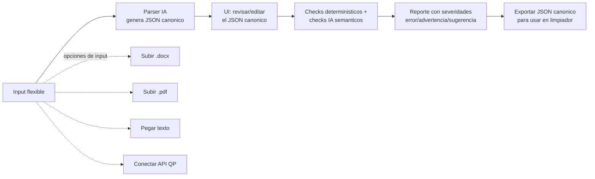

# Validador de Cuestionarios — Plan

> **Documento vivo.** Plan de un módulo nuevo del mega-dashboard, separado del Limpiador.
> Para el plan del Limpiador ver [limpiador-plan.md](./limpiador-plan.md).

## Resumen

Módulo independiente que permite analizar la calidad estructural y semántica de un cuestionario **antes de lanzar la encuesta**. El usuario sube el cuestionario en distintos formatos (Word, PDF, texto pegado, o conectándose directo a QuestionPro/Qualtrics), la IA lo parsea a un JSON canónico, ejecuta checks deterministicos + checks semánticos con IA, y devuelve un reporte con severidades por pregunta para que el usuario corrija el cuestionario antes de programarlo.

**Objetivo:** detectar problemas (preguntas redundantes, escalas invertidas, flujos rotos, wording sesgado, etc.) **mientras todavía se pueden arreglar**, no después de tener respuestas recolectadas.

**Origen del concepto:** [survey-qc-app](https://github.com/) — proyecto previo del usuario que es prácticamente el MVP de esta misma idea. Mucho del código y el schema canónico se pueden portar directamente.

## Diferencia con el Limpiador

| Validador (este plan) | Limpiador (plan separado) |
|---|---|
| Pre-launch (no requiere respuestas) | Post-collection (requiere Excel de respuestas) |
| Output: reporte de issues estructurales | Output: Excel limpio + sync a QP |
| Input: docs del cuestionario | Input: Excel de respuestas + API de QP |
| Ejecuta una vez antes del lanzamiento | Ejecuta cada vez que llega un nuevo dump de respuestas |

**Punto de integración:** un cuestionario validado puede exportarse como JSON canónico y un proyecto del Limpiador con `source=questionpro` puede importarlo en su Paso 3 (generación de reglas) en lugar de re-fetcher desde la API. Es opcional; cada módulo funciona independiente.

## Flujo del módulo



---

## Schema canónico del cuestionario

Portado directamente de [survey-qc-app/src/lib/types/questionnaire.ts](https://github.com/). Tipos en `src/lib/cuestionario/types.ts`:

```ts
export type QuestionType =
  | "cerrada_unica"
  | "cerrada_multiple"
  | "escala"
  | "matriz"
  | "abierta_texto"
  | "abierta_marca"
  | "numerica"
  | "ranking"
  | "fecha";

export interface QuestionOption {
  codigo: number;
  texto: string;
  flujo: string;             // "" | "terminar" | "saltar_a F5"
  condicion: string[];       // ["fijar"] | ["especificar"] | ["exclusiva"] | []
}

export interface FlowRule {
  si_respuesta: number | number[];
  accion: "saltar_a" | "terminar" | "continuar";
  destino?: string;
}

export interface Question {
  id: string;
  numero: number;
  texto: string;
  tipo: QuestionType;
  condicion: string;         // ej "S1=3", siempre presente, puede ser ""
  aleatorizar: boolean;
  opciones: QuestionOption[];
  flujo: FlowRule[];
  min?: number;              // solo escala/numerica
  max?: number;
  enunciados?: QuestionOption[]; // solo matriz: filas (items)
}

export interface Section {
  nombre: string;
  preguntas: string[];
}

export interface QuestionnaireMetadata {
  titulo: string;
  fecha: string;
  pais: string;
  idioma: string;
}

export interface Questionnaire {
  metadata: QuestionnaireMetadata;
  preguntas: Question[];
  secciones: Section[];
}
```

---

## Inputs soportados (priorización)

### Fase 1: Texto pegado en textarea
- **Por qué primero:** sin parser de archivos, sin dependencias nuevas. Un usuario pega el cuestionario crudo (cualquier formato textual) y la IA lo estructura.
- **Implementación:** un endpoint `/api/cuestionario/parse-text` que recibe `{ rawText }` y devuelve el `Questionnaire` JSON via OpenAI con structured output (Zod schema).

### Fase 2: Word `.docx`
- **Dependencia nueva:** `mammoth` (igual que survey-qc-app). Convierte docx a HTML/texto estructurado en el server.
- **Implementación:** endpoint `/api/cuestionario/parse-docx` que recibe FormData con el file, extrae texto con mammoth, y delega al parser de texto.

### Fase 3: API directa de QP
- **Aprovecha infra existente:** `validateSurvey` + `getSurveyQuestions` (que se va a crear en el Limpiador 2.C). Agregar `getSurveyFullStructure(surveyId, apiKey)` que combina survey info + questions + opciones + flujo y devuelve `Questionnaire` directamente.
- **Implementación:** sin parsing IA, todo viene estructurado desde la API.

### Fase 4: PDF `.pdf`
- **Aprovecha infra existente:** `src/app/api/convert-pdf-to-images/route.ts`, `pdf2json`, `pdfjs-dist`.
- **Implementación:** extraer texto del PDF, delegar al parser de texto. Para PDFs con layout complejo (multi-columna, tablas) puede requerir vision con gpt-4o.

---

## Checks a ejecutar

### Deterministicos (sin IA, en `src/lib/cuestionario/checks.ts`)

Portados de [survey-qc-app/src/lib/qc/deterministic-checks.ts](https://github.com/):

| Check | Lógica |
|---|---|
| IDs duplicados | Dos preguntas con el mismo `id` |
| Códigos de opción duplicados | Dentro de una pregunta cerrada |
| Textos de opción duplicados | Dentro de una pregunta cerrada |
| Condición referencia pregunta inexistente | `condicion: "P99=1"` cuando P99 no existe |
| Flujo `saltar_a` a pregunta inexistente | Destino del salto no está en `preguntas[]` |
| Rangos de escala inválidos | `min >= max` |
| Flujos circulares | A salta a B, B salta a A (loops infinitos) |
| Preguntas inalcanzables | Por análisis del grafo de flujo, ninguna ruta llega a esta pregunta |
| Opción sin código o sin texto | Validación trivial |
| Pregunta sin texto | Validación trivial |
| Matriz con 0 o 1 enunciado | No tiene sentido como matriz |

### Semánticos (con IA, en `src/lib/cuestionario/ai-checks.ts`)

Patrón: por cada categoría, prompt específico a OpenAI con structured output.

| Check | Categoría | Cuando flagea |
|---|---|---|
| Preguntas redundantes | semantica | Texto muy similar entre dos preguntas, midiendo lo mismo |
| Escalas invertidas | wording | Escalas que cambian dirección entre preguntas (1=mejor en P1 vs 1=peor en P2) |
| Wording sesgado | wording | Preguntas con sesgo (leading questions, doble negación, doble pregunta) |
| Instrucciones ambiguas | wording | Instrucciones poco claras de respuesta |
| Tipo de pregunta incorrecto | tipos | Texto sugiere abierta pero está marcada como cerrada, etc. |
| Opciones no MECE | logica | En cerrada única, opciones que se solapan o no son mutuamente exclusivas |

---

## Output: reporte de validación

```ts
export interface QCIssue {
  pregunta_id: string | null;   // null para issues globales
  severidad: "error" | "advertencia" | "sugerencia";
  categoria: "estructura" | "logica" | "wording" | "tipos" | "rangos" | "semantica";
  descripcion: string;
}

export interface QuestionnaireValidationReport {
  questionnaire_id: string;
  parsed_at: string;
  validated_at: string;
  issues_por_pregunta: Array<{
    pregunta_id: string;
    pregunta_numero: number;
    pregunta_texto: string;
    issues: QCIssue[];
  }>;
  issues_globales: QCIssue[];
  resumen: {
    errors: number;
    advertencias: number;
    sugerencias: number;
    total: number;
  };
}
```

UI renderiza:
- Tarjeta por pregunta con sus issues (badges de severidad).
- Sección global aparte para issues que no son específicos de una pregunta (ej: "Faltan secciones agrupando preguntas").
- Filtros por severidad y categoría.
- Botón "exportar JSON canónico" (descarga `Questionnaire`).
- Botón "exportar reporte" (descarga PDF o XLSX legible).

---

## Storage

### Tablas Supabase (nuevas)

```sql
CREATE TABLE questionnaires (
  id UUID PRIMARY KEY DEFAULT gen_random_uuid(),
  user_id UUID REFERENCES auth.users(id) ON DELETE CASCADE,
  nombre TEXT NOT NULL,
  origen TEXT NOT NULL CHECK (origen IN ('texto', 'docx', 'pdf', 'questionpro_api')),
  archivo_nombre TEXT,
  qp_survey_id TEXT,
  qp_api_key_encrypted TEXT,
  questionnaire_json JSONB,        -- Questionnaire canonico
  created_at TIMESTAMPTZ DEFAULT now(),
  updated_at TIMESTAMPTZ DEFAULT now()
);

CREATE TABLE questionnaire_validations (
  id UUID PRIMARY KEY DEFAULT gen_random_uuid(),
  questionnaire_id UUID REFERENCES questionnaires(id) ON DELETE CASCADE,
  report JSONB NOT NULL,           -- QuestionnaireValidationReport
  validated_at TIMESTAMPTZ DEFAULT now()
);

CREATE INDEX idx_questionnaire_validations_qid ON questionnaire_validations(questionnaire_id);
```

Cada validación queda persistida → si el usuario edita el cuestionario y re-valida, queda historial. Se puede consultar la última validación con `ORDER BY validated_at DESC LIMIT 1`.

---

## Páginas y rutas

| Ruta | Descripción |
|---|---|
| `/cuestionario` | Lista de cuestionarios del usuario, con stats (total, validados, con errores). |
| `/cuestionario/nuevo` | Wizard: nombre → tipo de input → upload/paste/connect → parse → validar. |
| `/cuestionario/[id]` | Vista del cuestionario: muestra preguntas + último reporte de validación. Permite editar JSON, re-validar, exportar. |
| `/cuestionario/[id]/editar` | Editor del JSON canónico (interface más rica que un textarea, con UI tipada por tipo de pregunta). |

---

## API routes (nuevas)

| Ruta | Método | Función |
|---|---|---|
| `/api/cuestionario/parse-text` | POST | Recibe `{ rawText }`, devuelve `Questionnaire` JSON. |
| `/api/cuestionario/parse-docx` | POST | Recibe FormData con .docx, extrae con mammoth, devuelve `Questionnaire`. |
| `/api/cuestionario/parse-pdf` | POST | Recibe FormData con .pdf, extrae texto, devuelve `Questionnaire`. |
| `/api/cuestionario/from-qp` | POST | Recibe `{ surveyId, apiKey }`, descarga estructura completa, devuelve `Questionnaire`. |
| `/api/cuestionario/validate` | POST | Recibe `{ questionnaire_id }` o `{ questionnaire }`, ejecuta checks deterministicos + IA, devuelve `QuestionnaireValidationReport`. Usa SSE para streaming de progreso. |

---

## Iteraciones de implementación

### Iteración 1 — Esqueleto + texto pegado
- Migración SQL (tablas `questionnaires`, `questionnaire_validations`).
- Tipos canónicos en `src/lib/cuestionario/types.ts`.
- Página `/cuestionario` (lista) y `/cuestionario/nuevo` con solo input "pegar texto".
- API route `/api/cuestionario/parse-text` con OpenAI structured output.
- Página `/cuestionario/[id]` que muestra el JSON parseado (sin checks aún).

**Resultado:** se puede pegar un cuestionario, parsearlo con IA, ver el JSON canónico.

### Iteración 2 — Checks deterministicos
- Portar `deterministic-checks.ts` desde survey-qc-app a `src/lib/cuestionario/checks.ts`.
- API route `/api/cuestionario/validate` con solo checks deterministicos (sin IA todavía).
- UI del reporte en `/cuestionario/[id]` con tarjetas por pregunta + severidades.
- Botón "validar" que dispara el endpoint y persiste en `questionnaire_validations`.

**Resultado:** validación rápida sin costo de IA. Detecta flujos rotos, IDs duplicados, rangos inválidos, etc.

### Iteración 3 — Checks semánticos con IA
- `src/lib/cuestionario/ai-checks.ts` con un check por categoría (redundancia, escalas, wording, etc.).
- Extender `/api/cuestionario/validate` con SSE: emitir progreso por cada categoría procesada.
- UI: badges separados por categoría en el reporte.
- Prompt caching estructurado para reducir costos en re-validaciones del mismo cuestionario.

**Resultado:** validación completa + UX en tiempo real. Costos controlados.

### Iteración 4 — Editor del JSON canónico
- Página `/cuestionario/[id]/editar` con UI tipada (no JSON crudo): cards por pregunta, dropdowns para tipo, inputs para opciones, drag & drop para reordenar.
- Validación inline al editar (re-correr checks deterministicos en el cliente).
- Re-validar IA on-demand (el usuario decide cuándo gastar tokens).

**Resultado:** el usuario puede arreglar problemas detectados sin salir de la app.

### Iteración 5 — Inputs adicionales
- `/api/cuestionario/parse-docx` con mammoth.
- `/api/cuestionario/parse-pdf` con pdf2json + fallback a vision.
- `/api/cuestionario/from-qp` reusando `getSurveyQuestions` y agregando `getSurveyFullStructure`.

**Resultado:** flexibilidad total de input.

### Iteración 6 — Integración con Limpiador
- En `/limpiador/[id]/rules`: si el proyecto tiene `qp_survey_id` y existe un `questionnaire` con ese mismo `qp_survey_id` validado, ofrecer "Importar cuestionario validado" como atajo.
- Importar trae el JSON canónico que reemplaza/enriquece el `VersionSchema` del Paso 2.C del limpiador.

**Resultado:** los dos módulos se potencian mutuamente sin acoplarse.

### Iteración 7 (opcional) — Export del reporte
- Botón "exportar reporte" que genera PDF o XLSX legible para compartir con clientes/diseñadores.

---

## Patrones reusables de survey-qc-app

| Patrón | Archivo de origen | Donde aplica |
|---|---|---|
| Tipos canónicos `Questionnaire` | `src/lib/types/questionnaire.ts` | Iteración 1 |
| Checks deterministicos | `src/lib/qc/deterministic-checks.ts` | Iteración 2 |
| Catálogo `questionnaire_structure_rules` editable | DB | Iteración 3 (decisión: tabla o hardcoded) |
| Streaming SSE para validate | `src/app/api/qc-questionnaire/route.ts` | Iteración 3 |
| Prompt caching | `src/app/api/qc-questionnaire/route.ts` | Iteración 3 |
| Parser docx con mammoth | `src/app/api/parse-questionnaire/route.ts` | Iteración 5 |
| Anotaciones por pregunta + globales | `src/lib/types/rules.ts` (`QCResultAnnotated`) | Iteración 2-3 |
| Sistema severidad/colores | `src/lib/types/rules.ts` (`scoreToRuleColor`) | Iteración 2-3 |

---

## Riesgos y notas

- **Calidad del parsing IA**: cuestionarios largos o con formato muy específico pueden parsear mal. Mitigación: el editor (Iteración 4) permite corregir manualmente. También considerar few-shot examples en el prompt.
- **Costo de IA en validate**: si un cuestionario tiene 100 preguntas y se corren 6 categorías de checks IA, son 600 evaluaciones. Mitigación: agrupar por categoría en una sola llamada (procesar todas las preguntas en batch), prompt caching, modelo `gpt-4o-mini` por defecto.
- **PDFs complejos**: layouts multi-columna o con tablas pueden romper la extracción de texto. Mitigación: fallback a vision con gpt-4o (más caro pero más robusto).
- **API de QP no expone toda la skip logic** en `/surveys/{id}/questions`. Verificar antes de la Iteración 5 si hay que llamar también a `/surveys/{id}/blocks` o similar.
- **Migración futura del concepto a Qualtrics**: el schema canónico está pensado para ser provider-agnostic. Si se agrega Qualtrics, solo hay que escribir un nuevo `from-qsf` (parser del export de Qualtrics) sin tocar nada más.

---

## Decisiones pendientes

- **Modelo IA por defecto**: `gpt-4o` (mejor calidad, más caro) o `gpt-4o-mini` (más barato, suficiente para checks simples). Posiblemente: mini por defecto, opción de cambiar a 4o para checks complejos.
- **Catálogo de reglas editable vs hardcoded**: survey-qc-app tiene tabla `questionnaire_structure_rules` con `prompt_ia` editable. Es más flexible pero suma complejidad. Recomendación: arrancar hardcoded en Iteración 2-3, migrar a tabla solo si el usuario quiere customizar.
- **¿El validador requiere autenticación?** En survey-qc-app sí (Supabase Auth + Google OAuth). En el mega-dashboard ya hay auth, así que es directo reusarla.
- **Persistencia de `qp_api_key`**: si se guarda al usar input "questionpro_api", aplica la misma decisión de encriptación que en el limpiador. Reusar el mismo helper.
