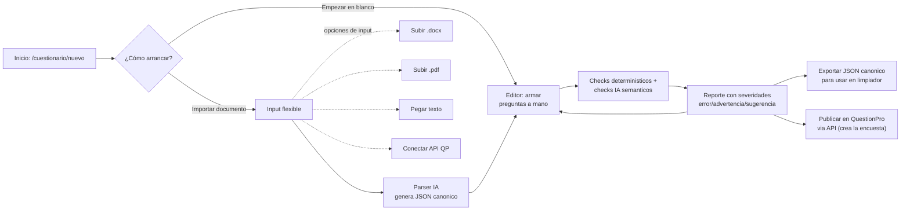

# Validador de Cuestionarios — Plan

> **Documento vivo.** Plan de un módulo nuevo del mega-dashboard, separado del Limpiador.
> Para el plan del Limpiador ver [limpiador-plan.md](./limpiador-plan.md).

## Resumen

Módulo independiente que permite **construir, validar y publicar** un cuestionario de QuestionPro **antes de lanzar la encuesta**. El usuario puede empezar desde cero (armando preguntas/opciones a mano en el editor) o partir de un documento existente (Word, PDF, texto pegado, o conectándose directo a QuestionPro). Cuando viene de un documento, la IA lo parsea a un JSON canónico. En cualquier caso, después se ejecutan checks deterministicos + checks semánticos con IA, y se devuelve un reporte con severidades por pregunta para que el usuario corrija lo que haga falta. Cuando el cuestionario queda limpio, con un botón puede **publicarse directo en QuestionPro vía API** (crea la encuesta con sus preguntas, opciones y flujo, lista para programar).

**Objetivo:** detectar problemas (preguntas redundantes, escalas invertidas, flujos rotos, wording sesgado, etc.) **mientras todavía se pueden arreglar**, no después de tener respuestas recolectadas.

**Origen del concepto:** [survey-qc-app](https://github.com/) — proyecto previo del usuario que es prácticamente el MVP de esta misma idea. Mucho del código y el schema canónico se pueden portar directamente. **Importante:** `survey-qc-app` es una app Next.js (route handlers, `fetch` server-side, FormData, SSE). Acá estamos en **Tauri 2 desktop** (Limpiador-style): TS-only en el renderer llamando directo a OpenAI/Supabase con `fetch`/SDK. Toda referencia a "API route `/api/...`" en este documento es **conceptual**: en la implementación real son módulos en `src/lib/cuestionario/` invocados directamente desde la vista. Ver sección [Arquitectura en Tauri](#arquitectura-en-tauri) más abajo.

## Diferencia con el Limpiador

| Validador (este plan) | Limpiador (plan separado) |
|---|---|
| Pre-launch (no requiere respuestas) | Post-collection (requiere Excel de respuestas) |
| Output: reporte de issues estructurales | Output: Excel limpio + sync a QP |
| Input: docs del cuestionario | Input: Excel de respuestas + API de QP |
| Ejecuta una vez antes del lanzamiento | Ejecuta cada vez que llega un nuevo dump de respuestas |

**Punto de integración:** un cuestionario validado puede exportarse como JSON canónico y un proyecto del Limpiador con `source=questionpro` puede importarlo en su Paso 3 (generación de reglas) en lugar de re-fetcher desde la API. Es opcional; cada módulo funciona independiente.

## Flujo del módulo



Los dos caminos de entrada — "empezar en blanco" e "importar documento" — convergen en el mismo editor del JSON canónico. Desde ahí el usuario itera (editar → validar → corregir) hasta que el reporte queda sin errores y puede publicar.

---

## Arquitectura en Tauri

Esta app **no es Next.js**, así que los "endpoints" del plan son módulos TS que viven en el renderer. Equivalencias:

| Plan (Next-style) | Implementación real (Tauri) |
|---|---|
| `POST /api/cuestionario/parse-text` | `parseTextToQuestionnaire(rawText)` en `src/lib/cuestionario/parser.ts` (fetch directo a OpenAI). |
| `POST /api/cuestionario/parse-docx` | `parseDocxToQuestionnaire(file)` en `src/lib/cuestionario/parser.ts`. Mammoth corre en el renderer (es WASM-friendly) o se mueve a un comando Rust si pesa demasiado. |
| `POST /api/cuestionario/parse-pdf` | `parsePdfToQuestionnaire(file)`. Para texto simple, `pdfjs-dist` en el renderer; para PDFs con layout complejo, fallback a vision con OpenAI (subir imágenes de páginas). |
| `POST /api/cuestionario/from-qp` | `fetchQuestionnaireFromQp(surveyId, apiKey)` en `src/lib/cuestionario/qp-import.ts`. Reusa los helpers de QP que arme el Limpiador. |
| `POST /api/cuestionario/validate` (con SSE) | `runValidation(questionnaire, { onProgress })` en `src/lib/cuestionario/validation-job.ts`. En vez de SSE, callback de progreso al renderer (mismo patrón que `cleaning-job.ts`). |
| `POST /api/cuestionario/publish-to-qp` | `publishQuestionnaireToQp(questionnaire, apiKey, opts)` en `src/lib/cuestionario/qp-publish.ts`. |

**Convenciones del módulo** (siguiendo el patrón del Limpiador):

- `src/lib/cuestionario/types.ts` — tipos canónicos.
- `src/lib/cuestionario/supabase-client.ts` — cliente Supabase cacheado, lanza `MissingSupabaseSettingsError` si faltan keys (igual que el Limpiador).
- `src/lib/cuestionario/questionnaire-repository.ts` — todos los reads/writes contra Supabase.
- `src/lib/cuestionario/parser.ts` — parsers (texto, docx, pdf) → `Questionnaire`.
- `src/lib/cuestionario/checks.ts` — checks deterministicos puros.
- `src/lib/cuestionario/ai-checks.ts` — checks semánticos via OpenAI.
- `src/lib/cuestionario/validation-job.ts` — orquestador con cancelación (mismo patrón que `cleaning-job.ts`).
- `src/lib/cuestionario/qp-import.ts` / `qp-publish.ts` — capa de QuestionPro.

**Routing dentro de la app:** la app no tiene React Router (ver `CLAUDE.md`). Es una máquina de estados dentro de `CuestionarioView.tsx` con screens `list → nuevo → editor → reporte`. Agregar `ToolId: "cuestionario"` a `TOOLS` en `src/components/Toolbar.tsx`.

**Settings nuevos** (en `tauri-plugin-store` via `src/lib/settings.ts`):
- `questionpro_api_key` ya existe en el Limpiador → reusar (es la misma key).
- `openai_api_key` ya existe → reusar (misma key).
- `cuestionario_model` (nuevo, opcional): `"gpt-4o-mini"` (default) | `"gpt-4o"`. Permite al usuario subir el modelo para checks complejos sin tocar código.

---

## Schema canónico del cuestionario

Portado directamente de [survey-qc-app/src/lib/types/questionnaire.ts](https://github.com/). Tipos en `src/lib/cuestionario/types.ts`:

```ts
export type QuestionType =
  | "cerrada_unica"
  | "cerrada_multiple"
  | "escala"
  | "matriz"
  | "abierta_texto"
  | "abierta_marca"
  | "numerica"
  | "ranking"
  | "fecha";

export interface QuestionOption {
  codigo: number;
  texto: string;
  flujo: string;             // "" | "terminar" | "saltar_a F5"
  condicion: string[];       // ["fijar"] | ["especificar"] | ["exclusiva"] | []
}

export interface FlowRule {
  si_respuesta: number | number[];
  accion: "saltar_a" | "terminar" | "continuar";
  destino?: string;
}

export interface Question {
  id: string;
  numero: number;
  texto: string;
  tipo: QuestionType;
  condicion: string;         // ej "S1=3", siempre presente, puede ser ""
  aleatorizar: boolean;
  opciones: QuestionOption[];
  flujo: FlowRule[];
  min?: number;              // solo escala/numerica
  max?: number;
  enunciados?: QuestionOption[]; // solo matriz: filas (items)
}

export interface Section {
  nombre: string;
  preguntas: string[];
}

export interface QuestionnaireMetadata {
  titulo: string;
  fecha: string;
  pais: string;
  idioma: string;
}

export interface Questionnaire {
  metadata: QuestionnaireMetadata;
  preguntas: Question[];
  secciones: Section[];
}
```

---

## Caminos de entrada (priorización)

### Camino A: Empezar en blanco
- **Por qué importa:** es la forma más simple y rápida cuando el usuario no tiene un documento previo y quiere armar el cuestionario directo en la app.
- **Implementación:** desde `/cuestionario/nuevo`, opción "Empezar en blanco" → pide solo `nombre` y `idioma`, crea una fila en `questionnaires` con `questionnaire_json` = `{ metadata, preguntas: [], secciones: [] }` y abre el editor de la Iteración 4 directo.
- **Disponible desde la Iteración 4** (cuando exista el editor tipado). En Iteraciones 1-3 el editor todavía es solo JSON crudo, lo cual es viable pero feo; preferible esperar a la 4 para promover este camino.

### Camino B: Importar documento → parsear con IA

#### B.1: Texto pegado en textarea
- **Por qué primero dentro de B:** sin parser de archivos, sin dependencias nuevas. Un usuario pega el cuestionario crudo (cualquier formato textual) y la IA lo estructura.
- **Implementación:** `parseTextToQuestionnaire(rawText)` en `src/lib/cuestionario/parser.ts` que llama a OpenAI con structured output (schema Zod). Disponible desde la Iteración 1.

#### B.2: Word `.docx`
- **Dependencia nueva:** `mammoth` (igual que survey-qc-app). Funciona en el renderer (no necesita Node). Convierte docx a texto plano y delega a `parseTextToQuestionnaire`.
- **Implementación:** `parseDocxToQuestionnaire(file)` en `src/lib/cuestionario/parser.ts`.

#### B.3: PDF `.pdf`
- **Dependencias nuevas:** `pdfjs-dist` para extraer texto. Para PDFs con layout complejo (multi-columna, tablas), fallback a vision con `gpt-4o` mandando imágenes de cada página.
- **Implementación:** `parsePdfToQuestionnaire(file)` en `src/lib/cuestionario/parser.ts`.

### Camino C: Conectar API de QuestionPro
- **Aprovecha infra existente:** los helpers `validateSurvey` + `getSurveyQuestions` que el Limpiador necesita en su Paso 2.C. Acá agregamos `getSurveyFullStructure(surveyId, apiKey)` que combina survey info + questions + opciones + flujo y devuelve `Questionnaire` directamente, **sin parsing IA** (todo viene estructurado).
- **Implementación:** `fetchQuestionnaireFromQp(surveyId, apiKey)` en `src/lib/cuestionario/qp-import.ts`.

---

## Checks a ejecutar

### Deterministicos (sin IA, en `src/lib/cuestionario/checks.ts`)

Portados de [survey-qc-app/src/lib/qc/deterministic-checks.ts](https://github.com/):

| Check | Lógica |
|---|---|
| IDs duplicados | Dos preguntas con el mismo `id` |
| Códigos de opción duplicados | Dentro de una pregunta cerrada |
| Textos de opción duplicados | Dentro de una pregunta cerrada |
| Condición referencia pregunta inexistente | `condicion: "P99=1"` cuando P99 no existe |
| Flujo `saltar_a` a pregunta inexistente | Destino del salto no está en `preguntas[]` |
| Rangos de escala inválidos | `min >= max` |
| Flujos circulares | A salta a B, B salta a A (loops infinitos) |
| Preguntas inalcanzables | Por análisis del grafo de flujo, ninguna ruta llega a esta pregunta |
| Opción sin código o sin texto | Validación trivial |
| Pregunta sin texto | Validación trivial |
| Matriz con 0 o 1 enunciado | No tiene sentido como matriz |

### Semánticos (con IA, en `src/lib/cuestionario/ai-checks.ts`)

Patrón: por cada categoría, prompt específico a OpenAI con structured output.

| Check | Categoría | Cuando flagea |
|---|---|---|
| Preguntas redundantes | semantica | Texto muy similar entre dos preguntas, midiendo lo mismo |
| Escalas invertidas | wording | Escalas que cambian dirección entre preguntas (1=mejor en P1 vs 1=peor en P2) |
| Wording sesgado | wording | Preguntas con sesgo (leading questions, doble negación, doble pregunta) |
| Instrucciones ambiguas | wording | Instrucciones poco claras de respuesta |
| Tipo de pregunta incorrecto | tipos | Texto sugiere abierta pero está marcada como cerrada, etc. |
| Opciones no MECE | logica | En cerrada única, opciones que se solapan o no son mutuamente exclusivas |

---

## Output: reporte de validación

```ts
export interface QCIssue {
  pregunta_id: string | null;   // null para issues globales
  severidad: "error" | "advertencia" | "sugerencia";
  categoria: "estructura" | "logica" | "wording" | "tipos" | "rangos" | "semantica";
  descripcion: string;
}

export interface QuestionnaireValidationReport {
  questionnaire_id: string;
  parsed_at: string;
  validated_at: string;
  issues_por_pregunta: Array<{
    pregunta_id: string;
    pregunta_numero: number;
    pregunta_texto: string;
    issues: QCIssue[];
  }>;
  issues_globales: QCIssue[];
  resumen: {
    errors: number;
    advertencias: number;
    sugerencias: number;
    total: number;
  };
}
```

UI renderiza:
- Tarjeta por pregunta con sus issues (badges de severidad).
- Sección global aparte para issues que no son específicos de una pregunta (ej: "Faltan secciones agrupando preguntas").
- Filtros por severidad y categoría.
- Botón "exportar JSON canónico" (descarga `Questionnaire`).
- Botón "exportar reporte" (descarga PDF o XLSX legible).
- Botón "publicar en QuestionPro" (ver sección siguiente). Deshabilitado mientras haya issues de severidad `error` sin resolver; con `advertencia`/`sugerencia` pide confirmación.

---

## Publicación en QuestionPro

Una vez que el cuestionario está validado y limpio, el usuario puede empujarlo a QuestionPro sin tener que recrearlo a mano en su panel. Es la contraparte "de ida" del input "Conectar API QP" (que es el de "vuelta").

### Flujo

1. El usuario abre `/cuestionario/[id]`, ve el reporte sin errores, y hace click en **"Publicar en QuestionPro"**.
2. Modal de confirmación: elige/confirma la API key de QP (reusa la del input `questionpro_api` si existe, o la pide), opcionalmente un nombre para la encuesta, e idioma. Muestra un resumen de qué se va a crear (N preguntas, M con flujo, etc.) y advierte que se crea una encuesta nueva en estado borrador (no se publica/activa automáticamente).
3. `POST /api/cuestionario/publish-to-qp` con `{ questionnaire_id, apiKey, nombre? }`:
   - Crea la encuesta (`POST /surveys`) → obtiene `surveyId`.
   - Mapea cada `Question` canónica al payload de QP (tipo de pregunta, opciones con su `codigo`/`texto`, `aleatorizar`, `min`/`max`, enunciados de matriz) y la agrega (`POST /surveys/{id}/questions`), respetando el orden de `preguntas[]` y agrupando por `secciones`.
   - Traduce `condicion` y `flujo[]` a la skip logic / branching de QP en una segunda pasada (necesita que todas las preguntas existan para resolver los `destino`).
   - Devuelve `{ qp_survey_id, qp_survey_url, warnings: string[] }` — `warnings` lista lo que no se pudo mapear 1:1 (ej. un tipo de pregunta sin equivalente exacto, una regla de flujo que QP no soporta así).
4. UI: muestra el link a la encuesta en QP, los warnings, y persiste `qp_published_survey_id` en la fila `questionnaires`. Si ya estaba publicada, el botón pasa a "Ver en QuestionPro" + "Re-publicar" (re-publicar crea otra encuesta nueva; QP no tiene un upsert limpio).

### Mapeo de tipos (canónico → QuestionPro)

| Canónico | QuestionPro |
|---|---|
| `cerrada_unica` | Single Select (Radio Button) |
| `cerrada_multiple` | Multiple Select (Checkbox) |
| `escala` | Numeric Slider / Net Promoter / Rating según `min`/`max` |
| `matriz` | Matrix (filas = `enunciados`, columnas = `opciones`) |
| `abierta_texto` | Text - Single Row / Multiple Row |
| `abierta_marca` | Text - Single Row con validación |
| `numerica` | Numeric - Text Box |
| `ranking` | Rank Order |
| `fecha` | Date |

> El mapeo exacto de subtipos de QP hay que confirmarlo contra la doc de la API (`POST /surveys/{id}/questions`) en la Iteración 8 — el catálogo de arriba es la primera aproximación. Donde no haya equivalente, el endpoint elige el más cercano y lo reporta en `warnings`.

### Implementación

- Helper nuevo en la capa de QP del Limpiador (la misma donde viven `validateSurvey` / `getSurveyQuestions`): `createSurveyFromQuestionnaire(questionnaire, apiKey, opts)`. Mantiene todo el contacto con la API de QP en un solo módulo.
- La API key de QP se pasa como en el resto del módulo (encriptada si se persiste; nunca en logs ni en query string). Reusar el mismo helper de encriptación del Limpiador.
- No se activa/publica la encuesta automáticamente: se deja en borrador para que el usuario revise en el panel de QP antes de lanzarla. (Decisión pendiente: ofrecer un checkbox "activar al crear".)

---

## Storage

### Tablas Supabase (nuevas)

Siguiendo el patrón del Limpiador (ver `docs/migrations/`): **sin `auth.users`** (la app es desktop, todos los usuarios comparten el proyecto Supabase corporativo) y **RLS permisiva** (`USING (true)`). La API key de QP **no se guarda en la tabla**, se lee de `tauri-plugin-store` cada vez (mismo patrón que el Limpiador).

```sql
CREATE TABLE questionnaires (
  id UUID PRIMARY KEY DEFAULT gen_random_uuid(),
  nombre TEXT NOT NULL,
  origen TEXT NOT NULL CHECK (origen IN ('blanco', 'texto', 'docx', 'pdf', 'questionpro_api')),
  archivo_nombre TEXT,
  qp_survey_id TEXT,               -- survey de origen si origen='questionpro_api'
  qp_published_survey_id TEXT,     -- survey creada al publicar en QP (Iteracion 8)
  qp_published_at TIMESTAMPTZ,
  questionnaire_json JSONB,        -- Questionnaire canonico
  created_at TIMESTAMPTZ DEFAULT now(),
  updated_at TIMESTAMPTZ DEFAULT now()
);

ALTER TABLE questionnaires ENABLE ROW LEVEL SECURITY;
CREATE POLICY "permitir todo" ON questionnaires
  FOR ALL USING (true) WITH CHECK (true);

CREATE TABLE questionnaire_validations (
  id UUID PRIMARY KEY DEFAULT gen_random_uuid(),
  questionnaire_id UUID REFERENCES questionnaires(id) ON DELETE CASCADE,
  report JSONB NOT NULL,           -- QuestionnaireValidationReport
  validated_at TIMESTAMPTZ DEFAULT now()
);

ALTER TABLE questionnaire_validations ENABLE ROW LEVEL SECURITY;
CREATE POLICY "permitir todo" ON questionnaire_validations
  FOR ALL USING (true) WITH CHECK (true);

CREATE INDEX idx_questionnaire_validations_qid ON questionnaire_validations(questionnaire_id);
```

Cada validación queda persistida → si el usuario edita el cuestionario y re-valida, queda historial. Se puede consultar la última validación con `ORDER BY validated_at DESC LIMIT 1`. La migración debe ir a `docs/migrations/` con número correlativo.

### Manejo de la API key de QuestionPro

- Se lee de `tauri-plugin-store` con un helper nuevo `getQuestionproApiKey()` en `src/lib/settings.ts` (mismo helper que va a usar el Limpiador — **única fuente**).
- En el modal de "Publicar" y en el camino C (importar desde QP) se muestra como pre-llenada si existe en settings; el usuario puede sobreescribirla solo para esa operación sin persistir.
- **Nunca** se loguea, **nunca** se manda como query string, **nunca** se persiste en Supabase. Si en el futuro hace falta multi-key (varias cuentas de QP), recién ahí evaluamos encriptación en DB.

---

## Screens del módulo

No hay router; son screens dentro de `CuestionarioView.tsx` con una máquina de estados (igual que `LimpiadorView.tsx`):

| Screen | Descripción |
|---|---|
| `list` | Lista de cuestionarios, con stats (total, validados, con errores). Botón "Nuevo cuestionario". |
| `nuevo` | Step 1: pedir nombre + idioma + elegir camino (Blanco / Texto / Docx / PDF / API QP). Step 2: según el camino, mostrar el input correspondiente y disparar el parse (excepto en "Blanco" que va directo al editor). |
| `editor` | Editor del JSON canónico con UI tipada por tipo de pregunta (Iteración 4). Botones: validar, exportar, publicar. |
| `reporte` | Vista del último reporte de validación: tarjetas por pregunta con sus issues + sección global. Filtros por severidad/categoría. Acciones: volver al editor, exportar JSON/reporte, publicar en QP. |

---

## Módulos / "endpoints" (nuevos)

Todos viven en `src/lib/cuestionario/`. Son funciones TS llamadas directamente desde la vista (no hay HTTP).

| Módulo | Función | Equivalente Next-style |
|---|---|---|
| `parser.ts` | `parseTextToQuestionnaire(rawText, opts)` | `POST /api/cuestionario/parse-text` |
| `parser.ts` | `parseDocxToQuestionnaire(file, opts)` | `POST /api/cuestionario/parse-docx` |
| `parser.ts` | `parsePdfToQuestionnaire(file, opts)` | `POST /api/cuestionario/parse-pdf` |
| `qp-import.ts` | `fetchQuestionnaireFromQp(surveyId, apiKey)` | `POST /api/cuestionario/from-qp` |
| `validation-job.ts` | `runValidation(questionnaire, { onProgress, signal })` | `POST /api/cuestionario/validate` (con SSE) |
| `qp-publish.ts` | `publishQuestionnaireToQp(questionnaire, apiKey, opts)` | `POST /api/cuestionario/publish-to-qp` |

El progreso de validación / publicación se reporta via `onProgress` callback al renderer (no SSE). Cancelación con `AbortSignal` o controller `{ promise, cancel() }` siguiendo el patrón de `cleaning-job.ts`.

---

## Iteraciones de implementación

### Iteración 0 — Spike de la API de QuestionPro (medio día)
**Antes de empezar nada,** confirmar contra la doc oficial / postman / un proyecto de prueba:
- `POST /surveys` — qué campos pide, qué devuelve, en qué estado queda (borrador/activa).
- `POST /surveys/{id}/questions` — qué subtipos de `questionType` acepta, formato de `answerOptions`, soporte de `min`/`max`/`enunciados`.
- Skip logic / branching — ¿se manda con la pregunta o requiere un endpoint aparte (`/surveys/{id}/blocks`, `/branching`, etc.)?
- Cuáles de los 9 tipos canónicos tienen equivalente 1:1 y cuáles no.

Output: un documento corto (`docs/qp-api-notes.md`) con el contrato real. Si la API **no** soporta crear branching complejo, ajustamos el alcance de la Iteración 8 (dejaríamos la skip logic en `warnings` para que el usuario la termine a mano en el panel de QP).

### Iteración 1 — Esqueleto + parsing de texto pegado
- Agregar `ToolId: "cuestionario"` a `TOOLS` en `src/components/Toolbar.tsx` + entry en `ViewId` en `App.tsx`.
- Crear `src/components/CuestionarioView.tsx` con la máquina de estados (`list → nuevo → editor → reporte`).
- Migración SQL en `docs/migrations/` (tablas `questionnaires`, `questionnaire_validations`, RLS permisiva).
- Tipos canónicos en `src/lib/cuestionario/types.ts` (portados de survey-qc-app).
- `supabase-client.ts` + `questionnaire-repository.ts` (CRUD básico).
- Screen `list` y `nuevo` con dos caminos: "Empezar en blanco" (crea fila con `questionnaire_json` vacío) y "Pegar texto" (llama al parser).
- `parser.ts::parseTextToQuestionnaire` usando OpenAI con structured output (Zod schema). Lee `openai_api_key` de settings.
- Screen `editor` provisorio: muestra el JSON crudo en un textarea editable + botón "Guardar". UI tipada se posterga a Iteración 4.

**Resultado:** se puede crear un cuestionario en blanco o pegando texto, parsearlo con IA y guardarlo. Sin checks aún.

### Iteración 2 — Checks deterministicos
- Portar `deterministic-checks.ts` de survey-qc-app a `src/lib/cuestionario/checks.ts`.
- `validation-job.ts::runValidation` con solo checks deterministicos (sin IA todavía). Reporta progreso via callback.
- Screen `reporte`: tarjetas por pregunta con sus issues + sección global. Badges de severidad (`scoreToRuleColor` portado de survey-qc-app).
- Botón "Validar" en el editor que corre `runValidation` y persiste el resultado en `questionnaire_validations`.

**Resultado:** validación rápida y gratis. Detecta flujos rotos, IDs duplicados, rangos inválidos, opciones duplicadas, etc.

### Iteración 3 — Checks semánticos con IA
- `src/lib/cuestionario/ai-checks.ts` con un check por categoría (redundancia, escalas invertidas, wording, tipos, MECE).
- Extender `runValidation` para emitir progreso por cada categoría procesada (callback al renderer, no SSE).
- UI: badges separados por categoría en el reporte + filtros.
- Prompt caching estructurado (`prompt_cache_key` de OpenAI) para reducir costo en re-validaciones del mismo cuestionario.
- Setting nuevo `cuestionario_model` con default `gpt-4o-mini`. Modelo configurable desde Settings.

**Resultado:** validación completa + UX en tiempo real. Costos controlados (mini por default).

### Iteración 4 — Editor tipado del JSON canónico
- Screen `editor` rehecho con UI tipada: cards por pregunta, dropdowns para `tipo`, inputs para opciones, drag & drop para reordenar, panel lateral para `flujo` y `condicion`.
- Validación inline al editar (re-correr checks deterministicos en memoria, sin persistir).
- Re-validar IA on-demand (el usuario decide cuándo gastar tokens).
- Promover "Empezar en blanco" en `nuevo` ahora que el editor está usable.

**Resultado:** el usuario puede armar un cuestionario desde cero o arreglar los detectados sin salir de la app.

### Iteración 5 — Inputs adicionales (docx, pdf, API QP) ✅
- `parser.ts::parseDocxToQuestionnaire` con `mammoth` (renderer-side, lazy import). ✅
- `parser.ts::parsePdfToQuestionnaire` con `pdfjs-dist` (lazy import + worker via `?url`). ✅ El fallback a vision con `gpt-4o` se **difirió**: hoy si la extracción de texto sale vacía/corta, el parser tira `ParseError` con un mensaje claro pidiendo "pegar texto". Se reabrirá si en uso real aparecen PDFs escaneados con frecuencia.
- `qp-import.ts::fetchQuestionnaireFromQp` reusando `validateSurvey` + `getSurveyQuestions` de `src/lib/questionpro.ts`. ✅ **Alcance acotado:** sólo preguntas + opciones (texto, tipo, código de opción). No se trae skip-logic / branching — eso requiere endpoints de QP que todavía no se confirmaron (queda para la Iteración 0 spike). Las matrices vienen sin `enunciados` (filas) y las escalas/numérica sin `min`/`max` porque la API no los expone vía `/questions`. Lo que no se mapea 1:1 se reporta como `warnings[]` y la UI los muestra antes de abrir el editor.
- UI: el wizard `NewQuestionnaire` pasa de 2 a 5 caminos (blanco, texto, docx, pdf, questionpro_api), con un `FilePicker` con drag&drop reutilizado del Limpiador para los caminos de archivo y una pantalla de validate→importar para la API de QP (mismo patrón que `NewProject` del Limpiador).

**Resultado:** flexibilidad total de input. Limitaciones conocidas: PDFs escaneados y branching de QP requieren follow-up.

### Iteración 6 — Integración con Limpiador ✅
- En el Paso 3 del Limpiador (generación de reglas), si el proyecto tiene `qp_survey_id` y existe un Questionnaire validado con ese mismo id, aparece un banner verde "Importar cuestionario validado" arriba de las sugerencias. ✅
- Match sólo por `qp_survey_id` (alcance acotado): `findValidatedQuestionnaireByQpSurveyId` en `questionnaire-repository.ts` busca el cuestionario más reciente con ese survey id que tenga al menos una validación corrida. ✅
- Aplicar enriquece el `VersionSchema` de la última versión del proyecto: matcheo por texto normalizado (`normalizeQuestionproMatchText`) y pisa `qp_question_type` (mapeado desde el tipo canónico a strings que las heurísticas de `rule-suggestions` ya reconocen) y `qp_options`. Adapter puro en `src/lib/cleaning/cuestionario-bridge.ts`; persistencia con `updateVersionSchema` nuevo en `versions-repository.ts`. ✅
- Idempotente: re-clicks no rompen nada y el resumen `matched/totalQuestionColumns` se muestra después de aplicar. Si el cuestionario todavía tiene errores pendientes, se muestra un warning ámbar (no bloquea). ✅

**Resultado:** los dos módulos se potencian mutuamente sin acoplarse — el bridge vive en `cleaning/` y consume el tipo `Questionnaire` como única superficie de contacto.

### Iteración 7 (opcional) — Export del reporte ⏸️ Diferida
- Botón "Exportar reporte" que genera PDF o XLSX legible para compartir con clientes/diseñadores.
- **Decisión 2026-05-15**: se difiere — el reporte en pantalla cubre la necesidad por ahora. Si en uso real aparece la necesidad de compartir el reporte fuera de la app, se retoma con XLSX (reuso de `xlsx-js-style`) como primera opción.

### Iteración 8 — Publicar en QuestionPro ✅
- **Spike de la API confirmado (Iteración 0 implícita)**: `POST /a/api/v2/users/{user-id}/surveys` para crear la encuesta (status="Active" pero sin preguntas) y `POST /a/api/v2/surveys/{survey-id}/questions` para agregar cada pregunta. Skip-logic / branching no se expone en endpoints v2 públicos claros — queda fuera de scope. ✅
- `qp-publish.ts::publishQuestionnaireToQp(questionnaire, opts)` orquesta: 1) crea la encuesta, 2) publica preguntas secuencialmente (orden importa, evitamos paralelismo para no comerla con 429), 3) reporta progreso vía `onProgress`, 4) soporta cancelación con `AbortSignal` entre preguntas (mismo patrón que `cleaning-job`), 5) si falla a mitad, devuelve `PublishToQpError` con `partial` y persistimos el `qp_published_survey_id` igual para que el usuario pueda completar a mano. ✅
- Tabla de mapeo canónico → QP confirmada contra la doc oficial:
  - `cerrada_unica` → `multiplechoice_radio`
  - `cerrada_multiple` → `multiplechoice_checkbox`
  - `escala` → `multiplechoice_radio` con opciones (warning sugiriendo cambiar a `numeric_slider` desde QP)
  - `matriz` → `matrix_radio` con `rows[]` + `columns[]`
  - `abierta_texto` → `text_multiple_row`
  - `abierta_marca` → `text_single_row`
  - `numerica` → `text_single_row` (warning: validación numérica no se setea por API)
  - `ranking` → `rank_order_drag_drop`
  - `fecha` → `text_single_row` (warning: tipo date no confirmado en v2)
  
  Lo no mapeable 1:1 (skip-logic, aleatorización, flags de opción `exclusiva`/`especificar`/`fijar`, secciones) se acumula en `warnings[]` que la UI muestra antes de cerrar el modal. ✅
- Settings nuevo: `questionpro.user_id` en `tauri-plugin-store` (sólo necesario para publicar — para importar/limpiar alcanza con la API key). Card propia en Ajustes con instrucciones para encontrarlo. ✅
- `qp_published_survey_id`/`qp_published_at` ya estaban en la migración inicial — no hizo falta migración nueva. Helper `updateQpPublishedInfo` en el repo. ✅
- UI en el screen `reporte`: botón "Publicar en QP" en el header (deshabilitado si hay errores pendientes, con tooltip explicando por qué; "Re-publicar en QP" si ya hay un id previo). Modal overlay con: resumen del cuestionario (N preguntas, M con flujo, K secciones), warning si ya está publicado, warning si quedan advertencias/sugerencias del reporte; barra de progreso durante el publish; resultado con link a QP + lista de warnings al final; manejo explícito del caso "encuesta parcial creada antes de fallar" para que el usuario abra el link y la termine en QP. ✅

**Resultado:** el ciclo completo sin salir de la app: crear/importar → validar → corregir → publicar en QP listo para programar. La skip-logic queda como follow-up manual; si en el futuro QP expone su endpoint de branching en v2, se agrega como segunda pasada después de crear las preguntas.

---

## Patrones reusables de survey-qc-app

> Recordatorio: survey-qc-app es Next.js. Lo que está como "route handler" allá, acá es una función en `src/lib/cuestionario/`.

| Patrón | Archivo de origen | Donde aplica |
|---|---|---|
| Tipos canónicos `Questionnaire` | `src/lib/types/questionnaire.ts` | Iteración 1 |
| Checks deterministicos | `src/lib/qc/deterministic-checks.ts` | Iteración 2 |
| Catálogo `questionnaire_structure_rules` editable | DB | Iteración 3 (decisión: tabla o hardcoded) |
| Streaming SSE para validate | `src/app/api/qc-questionnaire/route.ts` | Iteración 3 — en Tauri se reemplaza por callback `onProgress` |
| Prompt caching | `src/app/api/qc-questionnaire/route.ts` | Iteración 3 |
| Parser docx con mammoth | `src/app/api/parse-questionnaire/route.ts` | Iteración 5 |
| Anotaciones por pregunta + globales | `src/lib/types/rules.ts` (`QCResultAnnotated`) | Iteración 2-3 |
| Sistema severidad/colores | `src/lib/types/rules.ts` (`scoreToRuleColor`) | Iteración 2-3 |

---

## Riesgos y notas

- **Calidad del parsing IA**: cuestionarios largos o con formato muy específico pueden parsear mal. Mitigación: el editor (Iteración 4) permite corregir manualmente. También considerar few-shot examples en el prompt.
- **Costo de IA en validate**: si un cuestionario tiene 100 preguntas y se corren 6 categorías de checks IA, son 600 evaluaciones. Mitigación: agrupar por categoría en una sola llamada (procesar todas las preguntas en batch), prompt caching, modelo `gpt-4o-mini` por defecto.
- **PDFs complejos**: layouts multi-columna o con tablas pueden romper la extracción de texto. Mitigación: fallback a vision con gpt-4o (más caro pero más robusto).
- **API de QP no expone toda la skip logic** en `/surveys/{id}/questions`. Verificación movida a la **Iteración 0** (spike previo) para no llegar a la 8 con sorpresas.
- **Crear encuestas vía API de QP (Iteración 8)**: si el spike de la Iteración 0 confirma que se puede crear branching completo, perfecto. Si no, `publishQuestionnaireToQp` crea las preguntas igual y deja la skip logic en `warnings` para que el usuario la termine en el panel. La encuesta se crea siempre en borrador (no se activa) para no exponer una encuesta a medio mapear.
- **Migración futura del concepto a Qualtrics**: el schema canónico está pensado para ser provider-agnostic. Si se agrega Qualtrics, solo hay que escribir un nuevo `from-qsf` (parser del export de Qualtrics) sin tocar nada más.
- **Parsing en el renderer**: `mammoth` y `pdfjs-dist` corren fine en el renderer de Tauri (son WASM/JS). Si en algún momento un PDF muy grande causa lag en la UI, se puede mover a un comando Rust como hicimos con el sidecar de Brand Audit. No es prioridad para v1.

---

## Decisiones pendientes

- **Modelo IA por defecto**: ✅ `gpt-4o-mini` como default, configurable a `gpt-4o` desde Settings via `cuestionario_model`.
- **Catálogo de reglas editable vs hardcoded**: arrancar hardcoded en Iteración 2-3. Migrar a tabla `questionnaire_structure_rules` solo si después de usar el módulo unas semanas el usuario quiere customizar prompts.
- **Autenticación**: ✅ No aplica. App desktop, sin auth.users (mismo patrón que el Limpiador, RLS permisiva).
- **Persistencia de `questionpro_api_key`**: ✅ Solo en `tauri-plugin-store` (local), nunca en Supabase. Mismo helper que el Limpiador.
- **¿Activar la encuesta al publicar?** Por defecto se crea en borrador. Posible checkbox "Activar al crear" en el modal de publicación; arrancar sin él (más seguro).
- **¿Bloquear publicación con `error` pendiente?** ✅ Sí, botón deshabilitado si hay issues de severidad `error`. Con `advertencia`/`sugerencia` permite publicar previa confirmación.
- **Versionado del cuestionario**: ¿Cada "Guardar" en el editor crea una versión nueva o sobrescribe? Por simplicidad arrancamos sobrescribiendo (el historial queda solo en `questionnaire_validations`); si se vuelve necesario, se agrega `questionnaire_versions` después.
