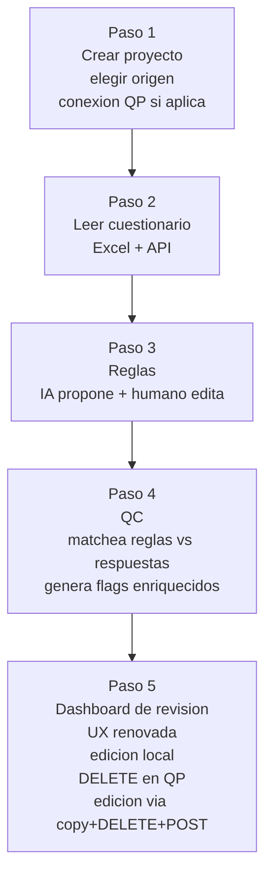
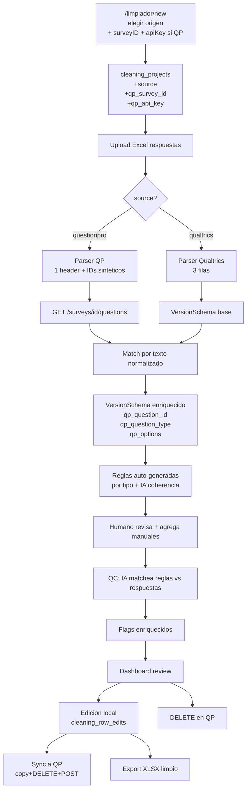
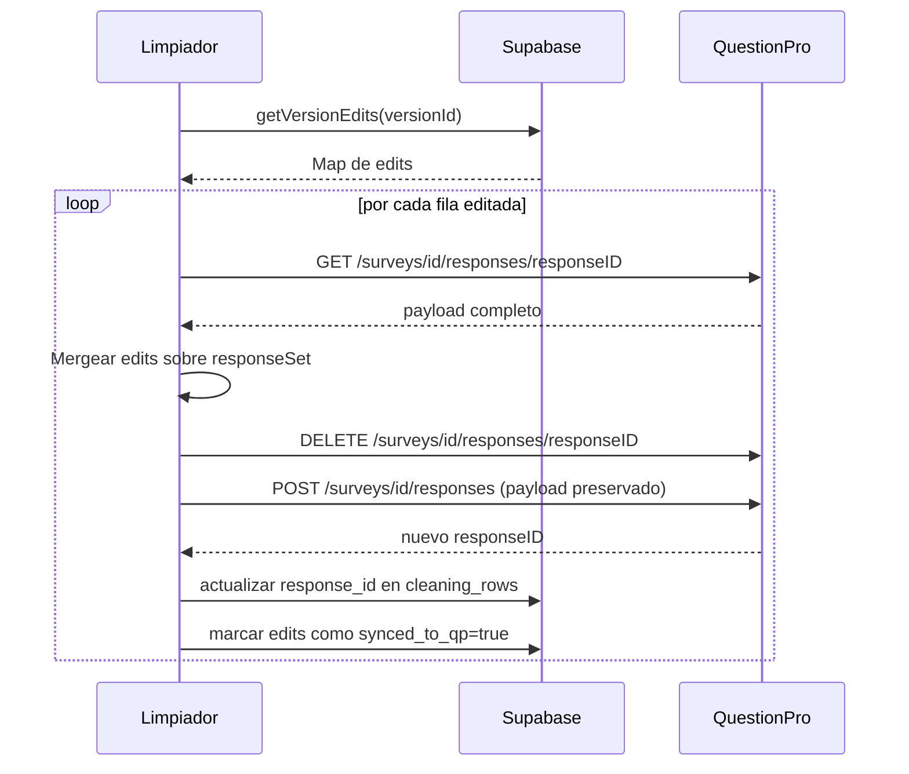

# Limpiador: Roadmap End-to-End Multi-origen + IA + Sync a QuestionPro

> **Documento vivo.** Refleja el plan vigente para rediseñar el módulo Limpiador.
> Para tareas concretas en curso ver `.cursor/plans/limpiador-multi-origen-revamp_*.plan.md`.

## Resumen

Rediseñar el Limpiador como un flujo end-to-end de 5 pasos para encuestas de Qualtrics y QuestionPro. Incluye lectura inteligente del cuestionario cruzando Excel + API, generación automática de reglas con IA, QC con flags enriquecidos, dashboard de revisión renovado con edición local, y sincronización a QuestionPro vía DELETE+POST preservando metadata.

## Roadmap del flujo (5 pasos)



> **Nota:** la validación estructural/semántica del cuestionario (detección de incoherencias, redundancias, sugerencias de wording) **NO** es parte del limpiador. Vive en un módulo separado: ver [cuestionario-validator-plan.md](./cuestionario-validator-plan.md).

## Decisiones tomadas (confirmadas)

- **Origen del archivo se elige a nivel proyecto** (no por versión).
- **Sincronización a QuestionPro es parte del flujo principal**, no una fase opcional. El `responseID` cambia y eso es aceptable; lo importante es preservar timestamp, IP, duplicate, location, timeTaken, status, customVariables, browser, OS, idioma y respuestas no editadas vía `POST /surveys/{id}/responses` (validado contra doc oficial).
- **Edición de respuestas: cualquier celda libremente con tracking del valor original** para revertir y auditoría.
- **El "leer el cuestionario" combina Excel + API**: el Excel da el texto de los headers, la API da los IDs internos, tipos y opciones. Se cruzan por texto normalizado.
- **Empezar por Etapa 2.A + 2.B juntas** (conexión QP + parser Excel). Es lo que desbloquea uso real más rápido.

## Regla de consulta previa para "Patrones de survey-qc-app a evaluar"

A lo largo del plan hay subsecciones marcadas como **"Patrones de survey-qc-app a evaluar"**. Son ideas tomadas de [survey-qc-app](https://github.com/), un proyecto previo del usuario que es conceptualmente similar al limpiador.

**Antes de implementar cualquiera de estas ideas:**
1. Consultar explícitamente al usuario.
2. Explicar qué se va a cambiar (archivos afectados, schema, comportamiento).
3. Explicar cómo se va a implementar (código nuevo vs portado, decisiones técnicas).
4. Esperar confirmación antes de tocar código.

Estas ideas NO son obligatorias; son sugerencias documentadas para que el usuario decida en cada etapa si las quiere o no. El plan base sigue siendo válido sin ellas.

## Arquitectura general



---

# Paso 1 — Crear proyecto + origen

## Migración SQL

```sql
ALTER TABLE cleaning_projects
  ADD COLUMN source TEXT NOT NULL DEFAULT 'qualtrics'
    CHECK (source IN ('qualtrics', 'questionpro')),
  ADD COLUMN qp_survey_id TEXT,
  ADD COLUMN qp_survey_name TEXT,
  ADD COLUMN qp_api_key_encrypted TEXT;
```

## Frontend
- `src/app/(dashboard)/limpiador/new/page.tsx`: wizard de pasos similar al de `src/app/(dashboard)/automatizaciones/nueva/page.tsx`:
  - Paso 1: nombre + descripción.
  - Paso 2: selector visual de origen (cards Qualtrics vs QuestionPro).
  - Paso 3 (solo si QP): pegar link/ID de encuesta + apiKey, botón "Validar" que usa `validateSurvey` de `src/lib/questionpro.ts` línea 43 y muestra nombre + total de respuestas.
- `src/app/(dashboard)/limpiador/page.tsx`: badge de origen + nombre de encuesta QP si aplica.
- `src/app/(dashboard)/limpiador/[projectId]/page.tsx`: badge en el header.
- `src/lib/cleaning.ts` línea 10: agregar `source`, `qp_survey_id`, `qp_survey_name`, `qp_api_key_encrypted` al tipo `CleaningProject` y propagar en `createCleaningProject` (línea 155).

## Patrones de survey-qc-app a evaluar (consultar antes)

- **Tracking de uso por usuario**: survey-qc-app tiene `usage_events` y contadores `proyectos_creados`, `qc_runs`, `exports_realizados` en `user_profiles`. Útil si se quiere métrica de adopción del limpiador.
- **`sharing_mode`**: campo `private | link | team` para compartir proyectos. Aplicable si se quiere colaboración.

---

# Paso 2 — Leer cuestionario (subdividido en 3 etapas)

## Etapa 2.A — Conexión QP a nivel proyecto

Cubierto por la migración + UI del Paso 1 cuando `source = questionpro`. Es el "plumbing" base sin el cual no se puede cruzar después con la API.

**Reutiliza:**
- `validateSurvey` ya existe en `src/lib/questionpro.ts` líneas 43-82.
- Lógica de `extractSurveyId` ya existe en `src/app/(dashboard)/automatizaciones/nueva/page.tsx` líneas 73-97.

**Decisión técnica de encriptación:** mirar el patrón actual con apiKey en automatizaciones (la tabla `automations` debería tenerlo). Reusar el mismo enfoque para consistencia.

## Etapa 2.B — Parser del Excel de respuestas QP

En `src/app/(dashboard)/limpiador/[projectId]/upload/page.tsx` líneas 72-152, partir `processExcelFile` en dos funciones según `project.source`:

| | Qualtrics (actual) | QuestionPro (nuevo) |
|---|---|---|
| Fila 1 | IDs (`Q1`, `Q2`,...) | Headers de texto (metadata + texto preguntas) |
| Fila 2 | Texto de preguntas | Primera fila de datos |
| Fila 3+ | Datos | Datos |
| Metadata | No tiene columnas fijas | `ID Respuesta`, `Fecha y Hora`, `Minutos`, `Estado`, `IP`, `Duplicado`, `País` (de `src/lib/questionpro.ts` líneas 132-141) |
| IDs | Vienen del archivo | Generar sintéticos: `META_ID_RESPUESTA`, `META_FECHA_HORA`, `META_MINUTOS`, `META_ESTADO`, `META_IP`, `META_DUPLICADO`, `META_PAIS`, `Q1`, `Q2`, ... |
| `response_id` por fila | Lee columna `ResponseId` | Lee columna `ID Respuesta` |

Validar que el formato del Excel coincide con el origen declarado y mostrar error claro si no (ej: "Este Excel no parece de QuestionPro porque falta la columna 'ID Respuesta'").

## Etapa 2.C — Enriquecer schema cruzando con API

Después de parsear el Excel, llamar a la API de QP para obtener la estructura real y mappear.

### Nuevas funciones en `src/lib/questionpro.ts`

```ts
export interface QPQuestion {
  questionID: number;
  questionText: string;
  questionType: string; // 'multiple_choice' | 'text' | 'number' | 'rating' | etc.
  options?: Array<{ answerID: number; text: string }>;
}

export async function getSurveyQuestions(
  surveyId: string,
  apiKey: string
): Promise<QPQuestion[]>
```

Llama `GET /surveys/{id}/questions` y normaliza la respuesta.

### Extender `VersionSchema`

En `src/lib/cleaning.ts` línea 69:

```ts
export interface VersionSchema {
  columns: Array<{
    index: number;
    id: string;              // sintético: META_*, Q1, Q2, ...
    question: string;        // texto del header
    qp_question_id?: number; // solo si source=questionpro y matcheó
    qp_question_type?: string;
    qp_options?: Array<{ answerID: number; text: string }>;
    is_metadata?: boolean;   // true para columnas META_*
  }>;
}
```

### Algoritmo de match por texto normalizado

```ts
function normalizeText(s: string): string {
  return s.toLowerCase().trim()
    .normalize('NFD').replace(/[\u0300-\u036f]/g, '') // quita acentos
    .replace(/\s+/g, ' ');
}

// Para cada columna del Excel (que NO sea metadata),
// buscar la pregunta de la API con normalizeText(question) === normalizeText(column.question).
// Si hay match: enriquecer la columna con qp_question_id, qp_question_type, qp_options.
// Si no hay match: dejarla sin enriquecer y reportarla.
```

### UI post-upload: resumen de mapping

Después del parse y enriquecimiento, antes de guardar la versión, mostrar:
- "X preguntas detectadas en el Excel"
- "Y matcheadas con la encuesta de QP"
- "Z sin match" (con lista expandible y opción de mapping manual: el usuario puede elegir manualmente la pregunta de QP que corresponde para cada una)

### Patrones de survey-qc-app a evaluar (consultar antes)

- **Tipos canónicos de pregunta**: `QuestionType = "cerrada_unica" | "cerrada_multiple" | "escala" | "matriz" | "abierta_texto" | "abierta_marca" | "numerica" | "ranking" | "fecha"`. Adoptarlos en `qp_question_type` da un vocabulario rico que después habilita reglas auto-generadas por tipo (ver Paso 3).
- **Schema rico con `QuestionOption` + `FlowRule` + `Section`**: si se descarga la encuesta entera de la API de QP (no solo preguntas, también opciones y skip logic), se puede armar un `Questionnaire` canónico. Habilita validaciones de consistencia más profundas. Si el proyecto tiene un cuestionario validado en el módulo Validador (ver [cuestionario-validator-plan.md](./cuestionario-validator-plan.md)), reusar ese JSON canónico aquí.
- **Match IA como fallback**: en survey-qc-app usan Claude para mapear preguntas a columnas Excel. En nuestro caso el match determinístico por texto debería cubrir el 90%+, pero IA como fallback para los no-matcheados es una opción.

## Etapa 2.D — REMOVIDA

**Decisión:** el análisis IA del cuestionario (detección de incoherencias, redundancias, sugerencias de wording) **se movió a un módulo separado** llamado "Validador de Cuestionarios".

**Razón:** una vez que ya hay respuestas, no se puede arreglar el cuestionario. El análisis estructural/semántico solo tiene sentido pre-launch. Lo único útil post-cleaning era "preguntas críticas para QC" y "relaciones de coherencia entre preguntas" — eso ahora va integrado directo en el Paso 3 sin paso intermedio.

**Plan del nuevo módulo:** ver [cuestionario-validator-plan.md](./cuestionario-validator-plan.md).

**Reuso opcional:** si un proyecto del limpiador con `source=questionpro` tiene asociado un cuestionario ya validado en el módulo nuevo, el Paso 3 puede importarlo en vez de re-analizar desde la API.

---

# Paso 3 — Reglas: IA propone + humano edita

## Input del paso 3

El paso 3 recibe directo el `VersionSchema` enriquecido del Paso 2.C (con `qp_question_id`, `qp_question_type`, `qp_options`). Si el proyecto tiene un cuestionario importado del módulo Validador, se usa ese JSON canónico (más rico) en lugar del schema crudo.

## Refactor de `src/app/(dashboard)/limpiador/[projectId]/rules/page.tsx`

Dividir en dos secciones:

1. **Sugeridas por IA** (nuevo): la IA pre-genera reglas a partir del schema enriquecido. Ejemplos:
   - "Marcar respuestas donde @Q22 (pregunta abierta) tenga menos de 10 caracteres"
   - "Eliminar si @Q4 (edad) está fuera del rango 16-99"
   - "Si @Q1=No entonces @Q5 debe estar vacía" (coherencia detectada en el schema)
   - Cada regla viene con su explicación y un toggle "aceptar / rechazar".
2. **Manuales** (existente): la UI actual con `@mention` se mantiene tal como está.

### Backend del paso 3
Nueva API route `/api/cleaning/suggest-rules` que recibe el schema enriquecido y devuelve un array de reglas sugeridas. Internamente:
- Reglas auto-generadas por tipo de pregunta (sin IA): abierta_texto → pocas_palabras + caracteres_repetidos; escala/matriz → straight_lining; cerrada con "especificar" → otros_especificar.
- Reglas de coherencia entre preguntas (con IA): el modelo razona sobre la skip logic y las relaciones lógicas detectadas.

### Migración SQL menor
Agregar a `cleaning_rules`:
```sql
ALTER TABLE cleaning_rules
  ADD COLUMN ai_generated BOOLEAN DEFAULT false,
  ADD COLUMN ai_reasoning TEXT;
```

## Patrones de survey-qc-app a evaluar (consultar antes)

- **Modelo question-centric** (cambio de schema importante): en lugar de reglas globales por proyecto, una fila por (proyecto, pregunta, tipo de regla). Tabla `project_question_rules` con campos `pregunta_id`, `tipo` (`abierta_marca`, `coherencia`, `straight_lining`, etc.), `instruccion`, `refs_pregunta_ids[]`. Ventaja: reglas asociadas a su pregunta, no flotantes. Costo: migración de schema y reescritura del UI de reglas.
- **Reglas auto-generadas SIN IA primero**: itera sobre las preguntas y según el `tipo` aplica reglas estándar (abierta_texto → pocas_palabras + caracteres_repetidos + profundizacion; escala/matriz/numerica → straight_lining; cerrada_* con "especificar" → otros_especificar). Solo después llama a IA para detectar reglas de **coherencia entre preguntas**. **Reduce costo de IA significativamente**.
- **Tipos canónicos de regla** (`ProjectRuleTipo`): `abierta_marca | abierta_profundizacion | coherencia | straight_lining | abierta_pocas_palabras | abierta_caracteres_repetidos | otros_especificar`. Más rico que el `recommendation: 'remove' | 'review' | 'keep'` actual.
- **Sistema severidad/colores**: mapeo `RuleColor = "verde" | "amarillo" | "naranja" | "rojo"` con `RULE_COLOR_WEIGHT` y `scoreToRuleColor(score)`. Permite que el dashboard muestre colores significativos según severidad acumulada.
- **Tabla `cleaning_rule_overrides`** con `instruccion_hash` (MD5 del texto de la regla). Permite que el usuario **omita reglas IA-generadas** sin borrarlas. Si la IA se regenera, las omitidas se respetan.
- **Streaming SSE** para feedback en tiempo real durante la generación de reglas.
- **Prompt caching**: estructurar prompts con la parte estable al inicio para aprovechar el caching automático de gpt-4o.

---

# Paso 4 — QC con flags enriquecidos

## Migración SQL

```sql
ALTER TABLE cleaning_flags
  ADD COLUMN affected_question_ids TEXT[] DEFAULT '{}',
  ADD COLUMN friendly_explanation TEXT,
  ADD COLUMN recommendation TEXT
    CHECK (recommendation IN ('remove','review','keep')),
  ADD COLUMN similar_response_ids TEXT[] DEFAULT '{}';
```

Actualizar tipo `CleaningFlag` en `src/lib/cleaning.ts` líneas 54-67.

## Servicio IA en Lightsail (diff a entregar aparte)

Según [LIMPIADOR_DEPLOYMENT.md](./LIMPIADOR_DEPLOYMENT.md), el servicio vive en `classification-service/services/cleaning-service.js`. Cambios:

- Pedirle al modelo que devuelva por flag: `affected_question_ids`, `recommendation` (`remove`/`review`/`keep`), y un `friendly_explanation` redactado para humano (formato: "Recomiendo {accion} porque en '{textoPregunta}' la respuesta '{valor}' {motivo}").
- Pasada adicional con embeddings (`text-embedding-3-small`) sobre preguntas abiertas para detectar similaridad cross-row con cosine sim > 0.85; cuando una fila cae en cluster, listar IDs en `similar_response_ids`.

## Patrones de survey-qc-app a evaluar (consultar antes)

- **Portar `field-checks.ts` directamente**: en survey-qc-app el archivo `src/lib/qc/field-checks.ts` tiene funciones puras (sin side effects, testeadas) que se pueden copiar a `src/lib/cleaning/field-checks.ts`:
  - `checkIpDuplicates(rows, ipColumn)` — detecta IPs repetidas
  - `checkDuration(rows, durationColumn)` — clasifica por percentil 5/95
  - `checkOpenEnded(value)` — flagea respuestas con menos de 3 palabras o 5+ caracteres repetidos
  - `checkStraightLining(row, columns)` — detecta mismo valor en todas las columnas de matriz
  - `checkOtrosEspecificar(value, opcionesCodificadas)` — detecta texto "otros" que coincide con opción ya codificada
- **Capa pre-IA**: ejecutar TODOS los checks deterministicos PRIMERO. La IA solo procesa filas que no fueron flageadas por reglas determinísticas o que tienen reglas de coherencia. Esto reduce el costo de OpenAI 60-80% en encuestas con preguntas cerradas/escalas (la mayoría).
- **Batching IA**: 500 casos por llamada × 3 reglas concurrentes. Verificar si el servicio actual en Lightsail ya batchea así; si no, ajustarlo.
- **Schema más rico de resultados por respondente**: agregar a `cleaning_flags` (o tabla nueva `cleaning_case_results`):
  - `nivel_maximo: "ok" | "advertencia" | "critico"`
  - `multiple_reglas: bool` (si la fila falló más de una regla)
  - `eliminado_de_base: bool` (decisión de excluir del análisis final, distinto de `user_decision`)
  - `row_snapshot: jsonb` (copia de la fila al momento del QC, para referencia inmutable)
- **SSE para progreso del QC**: en lugar de polling cada 3s, abrir un stream desde el servicio. Aplica también al endpoint del Lightsail si lo migramos. **No afecta costo de OpenAI**, solo UX.

---

# Paso 5 — Dashboard de revisión + edición + sync QP

## Etapa 5.A — Edición local de respuestas

### Migración SQL

```sql
CREATE TABLE cleaning_row_edits (
  id UUID PRIMARY KEY DEFAULT gen_random_uuid(),
  row_id UUID NOT NULL REFERENCES cleaning_rows(id) ON DELETE CASCADE,
  version_id UUID NOT NULL REFERENCES cleaning_versions(id) ON DELETE CASCADE,
  column_id TEXT NOT NULL,
  original_value JSONB,
  new_value JSONB,
  edited_at TIMESTAMPTZ NOT NULL DEFAULT now(),
  edited_by UUID,
  synced_to_qp BOOLEAN DEFAULT false,
  synced_at TIMESTAMPTZ,
  UNIQUE (row_id, column_id)
);
CREATE INDEX idx_row_edits_version ON cleaning_row_edits(version_id);
```

### Backend en `src/lib/cleaning.ts`
Nuevas funciones:
- `upsertRowEdit(rowId, versionId, columnId, originalValue, newValue)`
- `revertRowEdit(rowId, columnId)`
- `getVersionEdits(versionId): Promise<Map<rowId, Record<columnId, unknown>>>`
- Modificar `getCleanedRows` (línea 833): mergear edits sobre `row.data` antes de devolver.

### Frontend
En `src/app/(dashboard)/limpiador/[projectId]/[versionId]/review/page.tsx`:
- Edición inline de celdas (Input/Textarea según largo).
- Indicador "Editado" + valor original tachado en gris.
- Botón "revertir" por celda.
- "Ver respuesta completa" abre grilla con todas las celdas editables.

## Etapa 5.B — Rediseño visual de tarjetas de flag

Reescribir las tarjetas (líneas 430-562):
- **Recomendación destacada arriba** como badge grande: "Recomiendo eliminar/revisar/mantener".
- **`friendly_explanation`** como texto principal (reemplaza `flag.reason`).
- **Tarjeta de pregunta(s) afectada(s)** mostrando texto completo (resuelto vía `version.schema.columns.find(c => c.id === affected_id).question`) + valor problemático + edit inline (5.A).
- **Respuestas similares**: si `similar_response_ids` no vacío, collapsable con cards side-by-side mostrando el fragmento similar de cada otra respuesta.
- **Eliminar el toggle "Ver datos completos"** del comportamiento principal; queda como secundario "ver respuesta completa".
- En la grilla expandida (líneas 503-518), reemplazar `{key}` (ID) por `column.question` (texto). Si `question === id`, mostrar el ID en gris.
- Stats card "Editadas" en el panel (líneas 300-337).

### Filtros adicionales (líneas 340-368)
- Filtro por pregunta afectada (dropdown con preguntas que tienen flags).
- Filtro por recomendación (eliminar/revisar/mantener).

### Patrones de survey-qc-app a evaluar (consultar antes)

- **Visualización de respondentes con `nivel_maximo`**: vista alternativa "por respondente" en lugar de "por flag". Cada respondente con su color (verde/amarillo/naranja/rojo) según severidad acumulada. Útil cuando un respondente tiene múltiples flags y se quiere decidir global.
- **Bandera `eliminado_de_base` separada de `user_decision`**: distinguir entre "la respuesta es problemática" y "decidí no incluir este respondente en el análisis final". Permite segundo nivel de filtrado al exportar.

## Etapa 5.C — Acciones en QuestionPro vía API

### Eliminar respuesta en QP

Botón en cada flag "Eliminar respuesta también en QP" que llama:

```
DELETE /surveys/{qp_survey_id}/responses/{response_id}
```

Marca la fila como `user_decision: 'remove'` Y la borra de QP. Muestra confirmación.

### Sincronizar edits a QP (copy + DELETE + POST)

Botón "Sincronizar ediciones a QP" en el header del review. Flujo por cada fila con edits:



**Lo que se preserva en el POST** (validado en [Create Response doc](https://www.questionpro.com/api/create-response.html)):
- `timestamp`, `ipAddress`, `location`, `duplicate`, `timeTaken`, `responseStatus`, `customVariables`, `languageID`, `operatingSystem`, `osDeviceType`, `browser`.
- `responseSet` con `questionID` + `answerValues` (mergeando los edits).

**Lo único que cambia**: el `responseID` interno (aceptado por el usuario).

**Mapeo de campos traducidos al hacer POST a QP** (porque el Excel los muestra en español):
- `Estado`: `Completada` → `Completed`, `Iniciada` → `Started`, `Terminada` → `Terminated`.
- `Duplicado`: `Sí` → `true`, `No` → `false`.

### Funciones nuevas en `src/lib/questionpro.ts`
- `getResponse(surveyId, responseId, apiKey): Promise<QPFullResponse>`
- `deleteResponse(surveyId, responseId, apiKey): Promise<void>`
- `createResponse(surveyId, payload, apiKey): Promise<{ responseID: number }>`

## Etapa 5.D — Export ajustado

`src/app/(dashboard)/limpiador/[projectId]/[versionId]/export/page.tsx`: el merge ya lo hace `getCleanedRows` modificado en 5.A. Agregar al resumen "X filas, Y eliminadas, Z editadas, W sincronizadas a QP".

---

# Orden de implementación recomendado

1. **Iteración 1: Etapas 2.A + 2.B juntas** (base funcional QP).
   - Migración SQL del Paso 1.
   - UI de creación con conexión QP.
   - Parser branch QP en upload.
   - Resultado: se pueden crear proyectos QP y subir su Excel sin errores.
2. **Iteración 2: Etapa 2.C** (cruce con API).
   - `getSurveyQuestions` + extensión de schema + match.
   - UI de resumen post-upload.
   - Resultado: el sistema "entiende" el cuestionario con IDs internos.
3. **Iteración 3: Paso 3** (reglas auto-generadas).
   - API route `/api/cleaning/suggest-rules` con reglas por tipo + coherencia IA.
   - Refactor de rules para sección "Sugeridas por IA" + manuales.
4. **Iteración 4: Paso 4** (flags enriquecidos).
   - Migración + diff a Lightsail.
5. **Iteración 5: Etapa 5.A + 5.B** (edición local + rediseño visual).
6. **Iteración 6: Etapa 5.C** (DELETE + sync vía copy+DELETE+POST).
7. **Iteración 7: Etapa 5.D** (ajuste de export).

---

# Riesgos y notas

- **Match Excel ↔ API por texto puede fallar** si el cliente personalizó el texto al exportar (cambió mayúsculas, agregó prefijos). Mitigación: mapping manual cuando no hay match (ya contemplado en 2.C).
- **Costo de embeddings** para detección de similaridad cross-row (Paso 4). Considerar toggle "habilitar similaridad" en cada regla manual de tipo pattern.
- **Encriptación de apiKey de QP**: usar el mismo patrón que ya existe para automatizaciones; no inventar uno nuevo.
- **Endpoint `GET /surveys/{id}/questions`**: confirmar que existe en la API v2 antes de implementar 2.C (la doc lista la sección "Questions" pero conviene probarlo con un survey real).

---

# Índice de patrones de survey-qc-app por etapa

Resumen de los patrones distribuidos en el plan, para revisión rápida. Cada uno requiere consulta previa antes de implementar (ver "Regla de consulta previa" al inicio).

| Etapa | Patrón | Impacto |
|---|---|---|
| Paso 1 | Tracking de uso (`usage_events`) y `sharing_mode` | Bajo, agrega valor lateral |
| Etapa 2.C | Tipos canónicos `QuestionType` (cerrada_unica, escala, matriz...) | Medio, habilita reglas por tipo |
| Etapa 2.C | Schema rico `Question` + `QuestionOption` + `FlowRule` | Alto, requiere descargar más data de la API |
| Etapa 2.C | Match IA como fallback del determinístico | Bajo, opcional |
| Paso 3 | Streaming SSE en lugar de respuesta sincrónica | Bajo, mejora UX |
| Paso 3 | Prompt caching estructurado | Bajo, automático en gpt-4o |
| Paso 3 | Modelo question-centric (`project_question_rules`) | **Alto**, cambio de schema grande |
| Paso 3 | Reglas auto-generadas SIN IA primero | Medio, reduce costo IA significativamente |
| Paso 3 | Tipos canónicos `ProjectRuleTipo` | Medio, refactor de tipos |
| Paso 3 | Sistema severidad/colores con `scoreToRuleColor` | Medio, refactor de UI |
| Paso 3 | Tabla `cleaning_rule_overrides` con `instruccion_hash` | Medio, requiere tabla nueva |
| Paso 4 | Portar `field-checks.ts` (funciones puras) | Bajo, copy/paste con tests |
| Paso 4 | Capa pre-IA (deterministic primero, IA después) | **Alto**, reduce costo IA 60-80% |
| Paso 4 | Batching IA (500 × 3 concurrentes) | Bajo, ya puede estar implementado |
| Paso 4 | Schema rico `cleaning_case_results` (nivel_maximo, multiple_reglas, eliminado_de_base, row_snapshot) | Medio, tabla/columnas nuevas |
| Paso 4 | SSE para progreso del QC | Bajo, mejora UX |
| Etapa 5.B | Vista "por respondente" con `nivel_maximo` | Medio, vista alternativa nueva |
| Etapa 5.B | Bandera `eliminado_de_base` separada de `user_decision` | Bajo, refactor menor |
